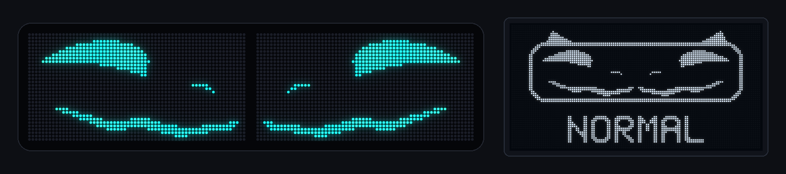
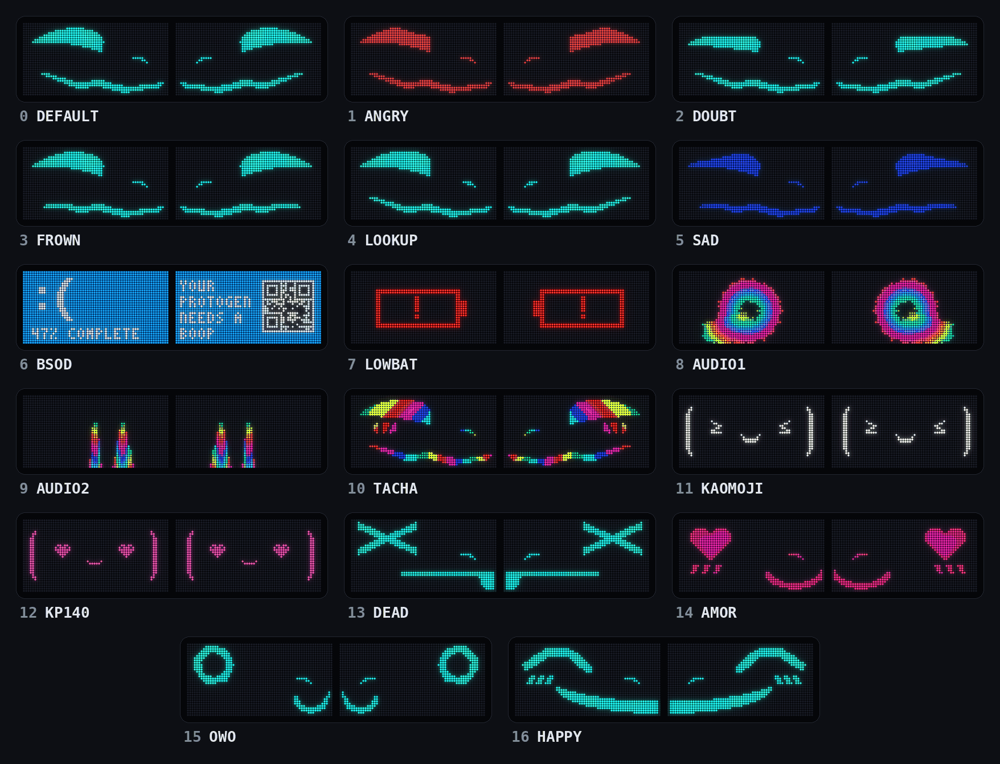
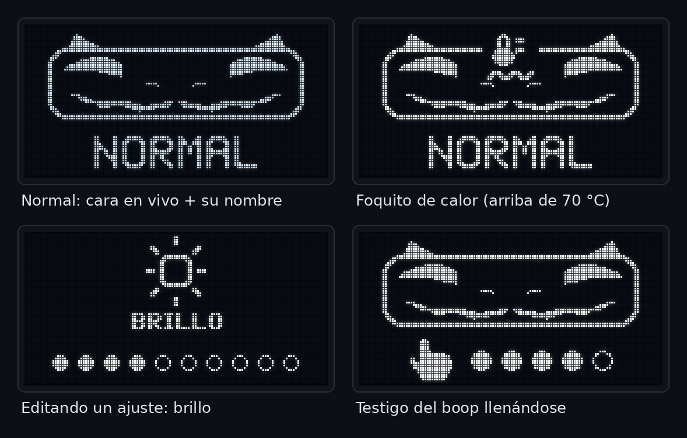
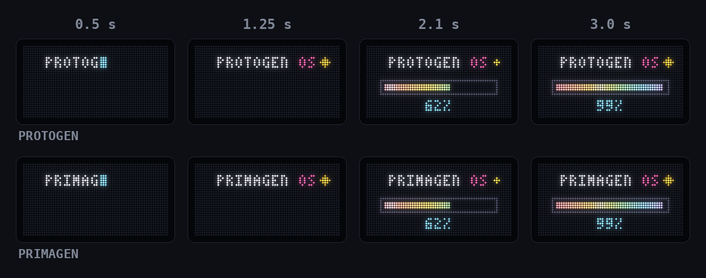
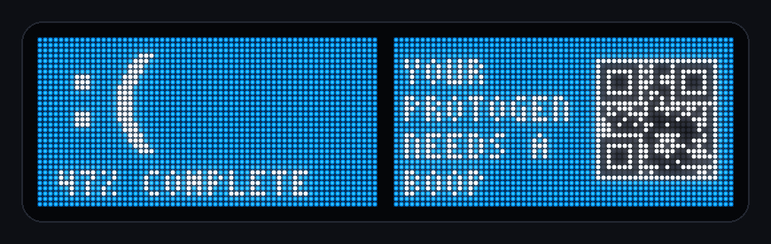
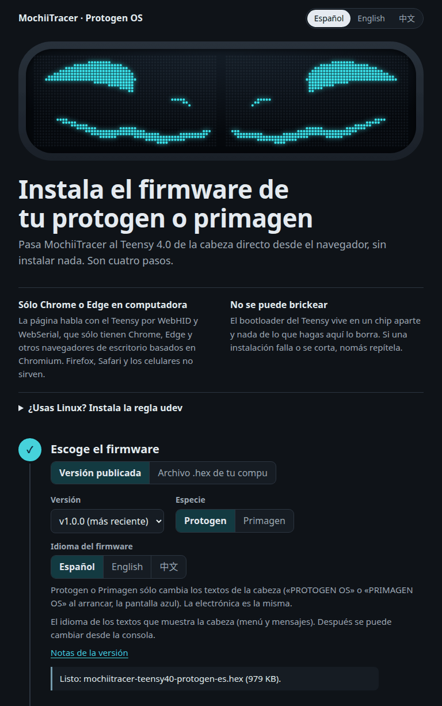

# MochiiTracer · Protogen OS

[English](README.md) · **Español** · [简体中文](README.zh-CN.md)

Fork de [ProtoTracer](https://github.com/coelacant1/ProtoTracer) de coelacant1 (AGPL-3.0) para
cabezas **Protogen y Primagen**. Las dos llevan la misma electrónica, así que un solo firmware
sirve para ambas.

Hecho por **Juls Denali / Tundra the furr / mochii the protogen**.



ProtoTracer es el motor 3D de coelacant1 que dibuja caras de protogen en matrices de LEDs, y él
hace todo el trabajo pesado. MochiiTracer le agrega caras nuevas, un boop que no se dispara
solo, una pantallita de adentro rediseñada, pantallas con letras que sí se leen, tres idiomas y
un instalador web. Lo usamos diario en una cabeza de verdad: un Teensy 4.0 en una placa Rhasky
PROTO CONTROL V3 con dos paneles HUB75 de 64×32.

Los *Primagen* son la especie madre de los Protogen, abierta en 2026 por Zenith's Outer Reach.
Una cabeza Primagen trae la misma electrónica con un visor más largo. Si la tuya acomoda los
paneles diferente, checa
[Visores Primagen y otras distribuciones de paneles](#visores-primagen-y-otras-distribuciones-de-paneles).

**Contenido:** [Qué trae](#qué-trae) · [Instalación](#instalación) · [Cómo se usa](#cómo-se-usa) ·
[Comandos por serial](#comandos-por-serial) · [Hardware](#hardware) ·
[Herramientas](#herramientas-para-quien-construye) · [Créditos y licencia](#créditos-y-licencia)

---

## Qué trae

### 17 caras



*Renders en una PC con el mismo motor ProtoTracer y el mismo código de caras del firmware, no fotos. AUDIO1 y AUDIO2 reciben una voz simulada.*

| # | Cara | Qué se ve | Mientras le haces boop |
|---|---|---|---|
| 0 | DEFAULT | La cara neutra de fábrica | Sorpresa |
| 1 | ANGRY | Cara de enojo, en rojo | Sorpresa |
| 2 | DOUBT | Mirada de "a ver, a ver" | Sorpresa |
| 3 | FROWN | Puchero | Sorpresa |
| 4 | LOOKUP | Mirando para arriba | Sorpresa |
| 5 | SAD | Triste y con puchero, en azul | Sorpresa |
| 6 | BSOD | Pantallazo azul de parodia a lo ancho de los dos paneles (abajo te cuento) | se queda |
| 7 | LOWBAT | Ícono de pila baja que parpadea. Es una cara que tú escoges, no mide tu batería | se queda |
| 8 | AUDIO1 | Degradado que reacciona al audio (de fábrica de ProtoTracer) | se queda |
| 9 | AUDIO2 | Analizador de espectro (el AUDIO3 de fábrica de ProtoTracer) | se queda |
| 10 | TACHA | Ojitos arcoíris, medio sorprendida | se queda |
| 11 | KAOMOJI | Seis kaomojis con flashes blancos estroboscópicos, loop de 1 s ⚠️ | se queda |
| 12 | KP140 | Kaomojis rosa fosfo, uno por beat con fade, a 140 BPM | se queda |
| 13 | DEAD | Ojitos x.x; a los 150 ms la boca se hace rayita y saca la lengua | TACHA |
| 14 | AMOR | ♡ω♡ corazones rosas que laten *ba-dum* cada 0.9 s, boca ω y chapitas | TACHA |
| 15 | OWO | O ω O ojos de anillo y boca ω; la transición entra en espiral | TACHA |
| 16 | HAPPY | ^‿^ ojitos cerrados en arco, sonrisota y chapitas | TACHA |

⚠️ **KAOMOJI prende todo el visor en blanco como seis veces por segundo.** No la pongas cerca de
alguien con epilepsia fotosensible.

DEAD, AMOR, OWO y HAPPY son caras nativas: morphs nuevos sobre la malla NukudeFlat de fábrica,
no videos. Por eso corren igual de rápido que las de fábrica (unos 75–80 FPS). Mientras están
puestas pausan el parpadeo e ignoran el micro, para que tu voz no les deforme la boca. Las caras
0–5 y 13–16 usan el color que escojas en el menú. ANGRY, SAD y AMOR traen el suyo.

### Boop + boooop: siguiente cara desde la nariz

Dale un boop cortito a la nariz, suelta, y vuelve a darle boop pero **déjale el dedo como 0.8 s**.
La cara cambia con el dedo todavía puesto, y una sola vez por cada vez que lo sostienes.

| Paso | Tiempo |
|---|---|
| Nada en la nariz antes | al menos 0.4 s |
| 1er boop (un tap) | 60–350 ms |
| Sueltas | 80–400 ms |
| 2o boop, sostenido | 0.8 s → siguiente cara |

**El doble tap a secas no hace nada, y es a propósito.** El doble tap de antes cambiaba la cara
solito. Los amigos te hacen boop en ráfaga, y el pelo, una capucha o una mano recargada en la
nariz hacen que el sensor de proximidad parpadee. Dos parpadeos en medio segundo se ven igualito
a un doble tap. En cambio, un tap seguido de un boop sostenido a propósito casi nunca pasa por
accidente. Después de un contacto largo (un abrazo, una mano que se quedó ahí) el gesto espera
2.5 s de silencio de verdad antes de volver a armarse. La base del sensor poco a poco "se traga"
una mano que no se mueve, así que el sensor ya no sabe cuándo la quitaste. Los tiempos y sus
porqués están en `lib/ProtoTracer/Examples/Protogen/BoopGesture.h`.

### La cara reacciona mientras le haces boop

Mientras hay un dedo en la nariz, las caras 0–5 se cambian a la **Sorpresa** arcoíris, y DEAD,
AMOR, OWO y HAPPY se cambian a **TACHA** (ojitos arcoíris). Al soltar, regresan a la suya. Si
apagas el sensor de boop en el menú, esto se apaga de verdad. En ProtoTracer de fábrica la cara
se podía quedar pegada en Sorpresa.

### El visorcito: la pantallita OLED de adentro



La OLED de 128×64 de adentro funciona como el tablero de un coche de noche. Enseña sólo lo
importante, y nunca un número.

- **Uso normal:** un visorcito dibujado con la cara en vivo adentro (los dos paneles, como te ve
  la gente) y el nombre de la cara. Las caras de imagen enseñan un pictograma.
- **Foquito de temperatura:** nada mientras el chip del Teensy esté bien. Arriba de 70 °C
  parpadea tranquilo un foquito de "motor caliente", que se apaga abajo de 65 °C. Arriba de 80 °C
  se prende todo el visor y parpadea rápido.
- **Ajustes:** sólo salen mientras los editas con el botón, con un ícono grande, una palabra
  corta y el valor en puntitos (o un switch NO/SÍ, o una palabra para colores y efectos).
- **Testigo del boop:** mientras haces el boop + boooop, el renglón del nombre se vuelve una
  manita con cinco puntitos que se van llenando. Cuando cambia la cara se convierte en una
  barrita prendida con palomita. Si soltaste antes, los puntitos se vacían. El boop sencillo de
  alguien más nomás se va.
- Está bajita de brillo para no lastimarte los ojos, se ilumina un ratito cuando cambia la cara
  y se mueve 1 px cada minuto para que la pantalla no se queme.
- **Al prender:** la OLED arranca junto con los LEDs, como 4 s. Primero un momentito el crédito
  AGPL de ProtoTracer, y luego el visorcito despierta y parpadea mientras carga **PROTOGEN OS**
  (o **PRIMAGEN OS**), sonríe `^ ^` y te saluda en su idioma (**¡HOLA!**, **HELLO!** o
  **你好！**).

### Pantalla de arranque: PROTOGEN OS



Al prender, "PROTOGEN OS" se escribe solito con su cursor. Luego una barra arcoíris pastel se va
llenando, se atora en 99% un buen rato (como todas), da un flashazo en 100% y se desvanece hacia
la cara. Son como 4 segundos, y al mismo tiempo arranca la OLED de adentro. Si la compilas para
Primagen dice **PRIMAGEN OS**.

### Pantallazo azul de parodia con QR que sí funciona



Un pantallazo azul dibujado en código a lo ancho de los dos paneles: un `:(` grandote, un
porcentaje que sube a saltos, **YOUR PROTOGEN NEEDS A BOOP** (o PRIMAGEN) y un QR de verdad que
puedes escanear. Al llegar a 100% "se reinicia" con la pantalla de arranque y vuelve a empezar.

### Texto derecho en paneles espejeados

Los dos paneles van en espejo por software, para que las caras salgan simétricas. Las pantallas
con letras (arranque, pantallazo, el patrón de calibración) se dibujan panel por panel como se ven
de frente. Así el texto se lee de izquierda a derecha en los dos, y no al revés en uno de ellos.
Si ese texto sale con los paneles cambiados o en espejo, lo arreglas con `k0`…`k3` (ve
[Comandos por serial](#comandos-por-serial)).

`k` sólo acomoda las pantallas con letras. Las caras lo ignoran, porque
`HUB75Controller::Display()` siempre pone la cámara en una mitad de la cadena y su espejo en la
otra. Y el bit 1 es un espejo horizontal, así que un panel montado de cabeza (girado 180°)
tampoco se arregla con `k`: eso pide cambiar el código en `HUB75Controller::Display()` y
`FrontToLogical()`.

### Abanicos al 100% de verdad

El menú de abanicos va de 0 a 9. ProtoTracer de fábrica lo multiplicaba por 25, así que el 9
mandaba 225/255 (88%) y los abanicos nunca llegaban a full. Ahora el 9 sí es 100%.

### Adiós al boop fantasma

En la biblioteca de Adafruit del APDS-9960, `readProximity()` regresa 156 cuando falla la lectura
por I²C. Eso parece un dedo en la nariz, y la cabeza recibía boops de nadie. Ahora el registro de
proximidad se lee a mano. Si una lectura falla se queda la última buena y se cuenta como error
(`i2cerr=` en el estado).

### Tres idiomas

La OLED habla **español** (el de default), **inglés** o **chino simplificado**. Para escoger:

- en el instalador web, o bajando el `.hex` de tu idioma;
- con la cabeza ya funcionando, manda `l0` (es), `l1` (en) o `l2` (zh) por serial. La cabeza lo
  guarda en EEPROM, así que sobrevive apagones y reflasheos, y **le gana al idioma con el que se
  compiló el `.hex`**. Para cambiarlo, manda otro `l<N>`, o `l255` para regresar al idioma del
  `.hex`;
- al compilar, con `-D IDIOMA_DEFECTO=0|1|2`.

---

## Instalación

Tres caminos, del más fácil al más clavado. Los tres terminan en el mismo firmware.

### 1. Instalador web (el más fácil)



1. Abre **<https://mochiitheproto.github.io/mochiitracer/instalar/>** en **Chrome o Edge**, en una
   compu. Usa WebHID y WebSerial, y Firefox, Safari y los celulares no los tienen.
2. Conecta el Teensy con un cable USB que pase datos (hay cables que nomás cargan).
3. Escoge tu especie (Protogen o Primagen) y tu idioma, y dale instalar. La página intenta
   reiniciar el Teensy en su bootloader ella solita. Si no puede, aprieta el botoncito del Teensy.

Sobre el idioma: si alguna vez le mandaste `l<N>` a esta cabeza, se queda con ese idioma diga lo
que diga el `.hex`. Cámbialo con los botones de idioma de la consola serial del instalador, o
manda `l255` para regresar al idioma del `.hex`.

La página también trae una consola serial con los comandos más útiles.

**En Linux** instala una vez la regla udev de PJRC, si no el navegador no ve el Teensy:

```bash
curl -fsSL https://www.pjrc.com/teensy/00-teensy.rules | sudo tee /etc/udev/rules.d/00-teensy.rules >/dev/null
sudo udevadm control --reload-rules && sudo udevadm trigger
```

### 2. Bajar el `.hex` y usar Teensy Loader

1. En la [página de Releases](https://github.com/mochiitheproto/mochiitracer/releases/latest),
   baja el archivo de tu cabeza:

   | | Español | Inglés | Chino |
   |---|---|---|---|
   | **Protogen** | `mochiitracer-teensy40-protogen-es.hex` | `mochiitracer-teensy40-protogen-en.hex` | `mochiitracer-teensy40-protogen-zh.hex` |
   | **Primagen** | `mochiitracer-teensy40-primagen-es.hex` | `mochiitracer-teensy40-primagen-en.hex` | `mochiitracer-teensy40-primagen-zh.hex` |

   Cada release trae también `SHA256SUMS`, para revisar tu descarga con
   `sha256sum -c SHA256SUMS --ignore-missing`, `manifest.json`, que es lo que lee el instalador
   web, las licencias de la fuente pixel china que va adentro del firmware (`OFL-1.1-*.txt`) y
   los avisos de las bibliotecas que trae compiladas (`THIRD-PARTY-NOTICES.txt`, `LGPL-2.1.txt`).
2. Instala el [Teensy Loader](https://www.pjrc.com/teensy/loader.html) oficial de PJRC. En Linux,
   también la regla udev de arriba.
3. En Teensy Loader abre el `.hex` (*File → Open HEX File*) y aprieta el botón del Teensy. Con
   *Auto* prendido lo programa y lo reinicia solo; si no, dale *Program* y luego *Reboot*.

### 3. Compilar con PlatformIO

Necesitas [PlatformIO](https://platformio.org/) (la línea de comandos o la extensión de VS Code).
Compila siempre el entorno `teensy40hub75`. Un `pio run` pelón compila también todos los demás
entornos de upstream. `platformio.ini` fija la plataforma de Teensy en `teensy@5.1.0` (GCC 11),
la misma con la que se compilan los releases. No la quites: la `teensy` 6.x más nueva (GCC 15) no
compila SmartMatrix 4.0.3.

```bash
git clone https://github.com/mochiitheproto/mochiitracer.git
cd mochiitracer
pio run -e teensy40hub75     # Protogen en español → .pio/build/teensy40hub75/firmware.hex
```

El idioma y la especie se escogen con banderas de compilación:

| Bandera | Valores | Sin ella |
|---|---|---|
| `-D IDIOMA_DEFECTO=<N>` | `0` español, `1` inglés, `2` chino simplificado | `0` |
| `-D ESPECIE_PRIMAGEN` | puesta o no | Protogen |

Para un build de una vez:

```bash
PLATFORMIO_BUILD_FLAGS="-D IDIOMA_DEFECTO=1 -D ESPECIE_PRIMAGEN" pio run -e teensy40hub75
```

Para dejarlo fijo, agrega tu propio entorno al `platformio.ini`:

```ini
[env:mi-cabeza]
extends = env:teensy40hub75
build_flags =
    ${env:teensy40hub75.build_flags}
    -D IDIOMA_DEFECTO=1
    -D ESPECIE_PRIMAGEN
```

y compílalo con `pio run -e mi-cabeza` (el `.hex` queda en `.pio/build/mi-cabeza/`).

Luego flashea el `firmware.hex` con Teensy Loader o con el instalador web (acepta un `.hex` de tu
compu), o con `pio run -e teensy40hub75 -t upload` (`-e mi-cabeza` para tu propio entorno). En
una máquina sin pantalla usa `tools/flash.sh`. Ése llama directo a `teensy_loader_cli`, porque
el upload de PlatformIO puede fallar calladito sin escritorio. `flash.sh` siempre compila
`teensy40hub75`: para tu propio entorno, flashea lo que salió con
`tools/flash.sh --hex .pio/build/mi-cabeza/firmware.hex`, o pásale las banderas con
`PLATFORMIO_BUILD_FLAGS` como arriba. Si cambiaste un header y parece que no agarró, corre
`pio run -t clean` y vuelve a compilar.

### Tranqui: un Teensy no se puede brickear

El bootloader del Teensy vive en otro chip chiquito que ningún firmware puede sobrescribir. Le
flashees lo que le flashees, si aprietas el botón del Teensy regresa al bootloader, listo para
otro `.hex`. Tus ajustes viven en la EEPROM y sobreviven al reflasheo. Si algún día quieres
borrar todo, el "15-second restore" de PJRC borra el Teensy y le carga su programa de parpadeo:
deja apretado el botón unos 15 s y suelta cuando el LED rojo dé un flashazo.

---

## Cómo se usa

### El botón

La cabeza probada tiene **un solo botón** (pin 23). Funciona como en ProtoTracer de fábrica:

- **apretón corto** → +1 al ajuste en el que estés (al llegar al final, da la vuelta);
- **apretón largo (más de 0.5 s)** → guarda el ajuste y pasa al siguiente de los **13 menús**.
  Después del último regresas a las caras.

Mientras estás en un ajuste, la OLED te lo enseña y el visor de LEDs muestra el menú propio de
ProtoTracer, con la cara más chiquita.

| # | Menú | Valores |
|---|---|---|
| 0 | Cara | las 17 caras (apretón corto = siguiente cara) |
| 1 | Brillo | 0–9 |
| 2 | Brillo de los lados | 0–9 (las tiras APA102 de acento de ProtoTracer) |
| 3 | Micro | apagado / prendido (la boca sigue tu voz) |
| 4 | Sensibilidad del micro | 0–9 |
| 5 | Sensor de boop | apagado / prendido |
| 6 | Espejo del espectro | apagado / prendido (para AUDIO2) |
| 7 | Tamaño de la cara | 0–9 |
| 8 | Color | degradado, amarillo, cian, blanco, verde, morado, rojo, azul, arcoíris, nebulosa |
| 9 | Tono de enfrente | rojo, naranja, amarillo, lima, verde, cian, azul, índigo, morado, rosa |
| 10 | Tono de atrás | la misma lista (los dos tonos pintan *degradado* y *nebulosa*) |
| 11 | Efecto | ninguno, onda ↕, onda ↔, onda radial, glitch, imán\*, lupa\*, borroso ↔\*, borroso ↕\*, borroso radial\* |
| 12 | Abanicos | 0–9 (9 = 100%) |

Aquí el color 2 es **cian**. En ProtoTracer de fábrica ese lugar es naranja.

\* Los efectos 5–9 (imán, lupa y los tres borrosos) todavía no hacen nada: los puedes escoger y
la OLED los nombra, pero la cara no cambia. ProtoTracer de fábrica los trae apagados
(`Menu::GetEffect()` regresa el efecto que no hace nada, `passthrough`), y este fork los deja
igual.

### Comandos por serial

Conecta el Teensy a una compu y abre su puerto serial USB: la consola del instalador web,
`pio device monitor` o el Monitor Serie de Arduino. Cualquier velocidad funciona menos **134**,
que reinicia el Teensy en el bootloader (el instalador web lo usa a propósito).

Manda **un comando por línea**, y la línea tiene que ser exactamente el comando. Todo lo demás
se ignora, igual que cualquier línea de más de 7 caracteres. Si le hablas al puerto con
`cat`/`echo` en Linux, primero corre `stty -F /dev/ttyACM0 raw -echo`. Con el eco prendido, la
cabeza recibe de regreso lo que ella misma imprime.

| Comando | Qué hace | ¿Se guarda? |
|---|---|---|
| `s` | Renglón de estado (ve abajo) | |
| `f<N>` | Cara N (0–16) | ✔ |
| `n` | Siguiente cara | ✔ |
| `b<N>` | Brillo 0–9 | ✔ |
| `l<N>` | Idioma de la OLED: `l0` español, `l1` inglés, `l2` chino simplificado. `l255` lo olvida y regresa al idioma con el que se compiló el `.hex` | ✔ |
| `k<N>` | Calibración de paneles para las pantallas con letras (arranque, pantallazo, `t`), 0–3: el bit 0 intercambia izquierda/derecha, el bit 1 hace espejo horizontal. Las caras lo ignoran | ✔ |
| `t` | Prende/apaga el patrón para calibrar: una L roja en el panel izquierdo y una R verde en el derecho, las dos derechitas | |
| `B` | Repite la pantalla de arranque | |
| `o0` / `o1` | Apaga la pantalla (negro total) / la prende. Con brillo 0 todavía se ve tantito | |
| `d` | Captura de lo que dibujó la cámara (64×32, en hex) | |
| `v` | Captura de lo que de verdad va a los paneles, vista de frente (128×32) | |
| `O` | Captura de la OLED (128×64) | |
| `w<N>` | Finge en la OLED que el chip está a N °C, para probar el foquito (`w0` = sensor real) | |
| `g<N>` | Un dedo de mentira para el gesto de boop, sin tocar la nariz: `g1` boop + boooop, `g2` boop sencillo, `g3` doble tap, `g4` soltar antes de tiempo, `g5` abrazo, `g6` dos boop + boooop seguidos (la cara cambia dos veces), `g0` parar. Sólo lo ve el gesto | |
| `p` / `q` | Prende/apaga el osciloscopio del boop: un renglón por frame, `P <ms> <prox> <base> <booped> <errores_i2c>` | |
| `a1` / `a0` | Prende/apaga el osciloscopio de audio: un renglón por frame con el volumen, la temperatura y un espectro de 128 bins | |

Los comandos con número contestan `OK <cmd>` o `ERR <cmd>` (fuera de rango, con el sensor de boop
apagado, o `g` durante el arranque). "Se guarda" quiere decir en EEPROM, igual que con el botón,
así que sobrevive apagones. `o`, `w` y `g` se olvidan con un reinicio. Ojo: si `g` dispara el
gesto, la cara cambia igual que con un dedo de verdad, y esa cara sí se guarda.

El renglón de estado empieza con `S` y trae campos `clave=valor`: `face` (número y nombre),
`bright`, `fan`, `pwm` (lo que de verdad les llega a los abanicos, 0–255), `boop`, `mic`, `color`,
`i2cerr` (lecturas fallidas del sensor de boop), `cal`, `temp` (el chip del Teensy, en °C), `w`,
`off`, `lang` y `t` (ms desde que prendió).

---

## Hardware

### Probado

| Pieza | En la cabeza probada | Notas |
|---|---|---|
| Microcontrolador | Teensy 4.0 | Existe `teensy41hub75` para el Teensy 4.1; compila, pero no se ha probado en una cabeza |
| Placa | Rhasky Workshops PROTO CONTROL V3 | Copia el cableado HUB75 del SmartLED Shield for Teensy 4 (V5) de Pixelmatix, así que las placas que copian ese shield deberían jalar |
| Visor | 2 paneles HUB75 de 64×32 | SmartMatrix los ve como una cadena de 64×64, un panel por mitad |
| OLED de adentro | SSD1306 de 128×64, I²C `0x3C` | El código trae un camino para SH1106 sin probar, pero `-D SH1106` no compila tal cual: la biblioteca `Adafruit_SH1106` no está en `lib_deps` |
| Sensor de boop | APDS-9960, I²C `0x39` | Sólo proximidad, en la nariz |
| Abanicos | Noctua NF-A4x20 5V PWM | Cualquier abanico de 5 V con PWM de 4 pines |
| Micrófono | el de la placa | Analógico |
| Botón | uno | |

Las orejas de la cabeza probada tienen su propio controlador Bluetooth, no las maneja el Teensy.
La salida APA102 de acentos de ProtoTracer sigue ahí, sin tocar y sin probar.

### Pinout (Teensy 4.0)

| Función | Pin |
|---|---|
| I²C SDA | 18 |
| I²C SCL | 19 |
| Botón | 23 |
| Micrófono (analógico) | 22 |
| PWM de los abanicos | 15 |
| HUB75 | igual que el SmartLED Shield V5 (`MatrixHardware_Teensy4_ShieldV5.h` en SmartMatrix) |

La OLED y el sensor de boop comparten el bus I²C. La OLED se refresca 5 veces por segundo para
dejarle el bus libre al sensor de boop.

**Antes de flashear por primera vez en una placa nueva**, el entorno `teensy40verifyhardware`
escanea el bus I²C y prueba el sensor de boop y la OLED por serial. Su prueba de NeoTrellis va
apagada, porque se cuelga para siempre si no tienes NeoTrellis.

### Visores Primagen y otras distribuciones de paneles

Si tu visor Primagen (o Protogen) sigue teniendo **dos paneles HUB75 de 64×32, uno por lado**, el
firmware jala tal cual. Flashea un build `primagen` y manda `t`: debes leer una L en el panel
izquierdo y una R en el derecho. Si salen cambiadas o en espejo, lo arreglas con `k0`…`k3`. Eso
sólo endereza las pantallas con letras (arranque, pantallazo, `t`); las caras lo ignoran. Si una
cara sale mal, o un panel va montado de cabeza (girado 180°), toca cambiar el código en
`HUB75Controller::Display()` / `FrontToLogical()` (el paso 2 de abajo).

Si encadenaste más paneles o unos diferentes, compila desde el código y ajusta estos lugares
(`lib/ProtoTracer/…`):

1. **`Controller/SmartMatrixHUB75.h`**: `kMatrixWidth` / `kMatrixHeight` son el tamaño de la
   cadena como la ve SmartMatrix (hoy 64×64 = dos paneles de 64×32 apilados), y `kPanelType` es
   el tipo de escaneo del panel (`SM_PANELTYPE_HUB75_32ROW_MOD16SCAN`).
2. **`Controller/HUB75Controller.cpp`**: `Display()` copia la cámara de 64×32 a un panel y su
   espejo al otro, sin pasar por la calibración `k`. `FrontToLogical()` traduce "panel, x, y
   vistos de frente" a la cadena para las pantallas con texto, y ahí es donde se aplica `k`.
3. **`Camera/CameraManager/Implementations/HUB75DeltaCameras.h`**: la cámara principal
   `PixelGroup<2048>(Vector2D(192.0f, 96.0f), Vector2D(0.0f, 0.0f), 64)` es una cuadrícula de
   64×32 que cubre 192×96 unidades de la escena. ProtoTracer de fábrica trae otras distribuciones
   de donde puedes partir (`HUB75SplitCameras.h` + `HUB75ControllerSplit`, `HUB75Square.h` +
   `HUB75ControllerSquare`). Los extras del fork (pantallas con texto, calibración de paneles,
   captura de frente) sólo existen en `HUB75Controller`.
4. **`Examples/Protogen/ProtogenHUB75Project.h`**: el constructor le pasa los límites de la
   cámara (`Vector2D(192.0f, 94.0f)`), `AlignObjectFace(pM.GetObject(), -7.5f)` acomoda la cara
   adentro, `SetMenuOffset` / `SetMenuSize` ponen el menú de LEDs de ProtoTracer, y las caras de
   imagen a pantalla completa usan planos de 192×94.
5. Las pantallas de arranque y pantallazo (`Assets/Screens/`) dibujan 128×32 vistas de frente, y
   el visorcito de la OLED, `tools/hostrender` y `tools/captura.py` dan por hecho 64×32 por lado.
   Échale ojo a esos también.

---

## Herramientas para quien construye

Todo vive en `tools/`. Casi todos los comentarios del código y las docs de las herramientas
están en español (`tools/oledsim` está documentado en inglés). Las notas de desarrollo están en
[`docs/LEARNINGS.md`](docs/LEARNINGS.md).

| Herramienta | Para qué sirve |
|---|---|
| `flash.sh` | `flash.sh <nombre>` compila `teensy40hub75`, respalda el `.hex` (en `~/protogen-backup/`, o `PROTOGEN_BACKUP=`), revisa su tamaño, flashea con reintentos y verifica que la cabeza regrese. `--hex archivo.hex` flashea uno ya hecho, `--build-only` sólo compila |
| `captura.py` | Capturas reales de la cabeza a PNG por serial: la cara, lo que va a los paneles (`--vista`), el arranque (`--boot`), la OLED (`--oled`), el gesto de boop con dedo de mentira (`--gesto N`) |
| `hostrender/` | El motor **real** de ProtoTracer compilado en tu compu. Para diseñar caras de morphs sin flashear: mapas de vértices, recetas, transiciones y C++ listo para pegar. Validado pixel por pixel contra capturas de la cabeza |
| `oledsim/` | Simulador de la OLED de adentro: corre el código real del HUD y el driver real de Adafruit contra un SSD1306 emulado |
| `oled/` | Generador reproducible de los íconos y fuentes de la OLED (`gen_assets.py` → `SoftAssets.*`) |
| `convert_webp_to_sequence.py` | WebP/GIF animado → cara (header `ImageSequence`) |
| `generate_video.py` | Cuadros de un video (PNG de ffmpeg) → cara con loop sin costura |
| `generate_kaomoji.py`, `generate_kaomoji_bpm.py` | Los generadores de las caras KAOMOJI y KP140 que vienen incluidas |
| `generate_smile.py`, `generate_eyes.py` | Ejemplos genéricos de imagen → animación: `generate_smile.py` hace de un dibujo un loop a 140 BPM con estrobo o fade, `generate_eyes.py` toma la paleta de una imagen de referencia para unos ojos pop-art animados. Ninguna cara incluida los usa |
| `generate_test_grid.py` | Genera `TestGrid.h`, una cuadrícula de calibración de 64×32 (esquinas de colores y una L para detectar el espejo). No es una cara ni el patrón de `t` |
| `led_preview.html` | Recorta una imagen o GIF a 64×32 y la previsualiza como LEDs en el navegador |
| `grabar-boop.sh`, `grabar-audio.sh` | Graban el osciloscopio del boop o del audio a un archivo, aguantando que se caiga el USB |
| `apagada-hasta.py` | Mantiene la pantalla apagada hasta una hora (`HH:MM`) |

Las herramientas de serial encuentran el Teensy solitas
(`/dev/serial/by-id/usb-Teensyduino_USB_Serial_*`). Con dos Teensys conectados se detienen con un
error claro. `TEENSY_PORT=` (o `--puerto`) escoge uno.

### Haz tu propia cara

1. **Cuadros:** un GIF/WebP animado pasa por `tools/convert_webp_to_sequence.py in.webp MiCara
   MiCara.h`. Para un video, saca cuadros de 64×32 con ffmpeg
   (`-vf "crop=…,fps=9,scale=64:32"`) y corre
   `tools/generate_video.py cuadros/ MiCara.h --class-name MiCara --overlap 12`. Prueba el
   recorte antes en `tools/led_preview.html`.
2. Pon el header en su propia carpeta dentro de `lib/ProtoTracer/Assets/Textures/Animated/`.
3. En `ProtogenHUB75Project.h` agrega el `#include`, un miembro (cópiate de `kaoPink140Anim`), un
   método de cara (cópiate de `KaomojiFace()`), su nombre en `faceArray` y un `case` en
   `SelectFace()`.
4. `faceArray` tiene tamaño fijo: súbelo en uno (`faceArray[17]` → `faceArray[18]`). De ahí en
   fuera el menú, la OLED y `f<N>` cuentan las caras solitos.
5. Agrégala **al final** (índice 17). Si la metes en medio, renumera los `case` que siguen y
   arregla la reacción al boop en `SelectFace()`: sus rangos son números fijos (`code < 6` →
   Sorpresa, `code >= 13 && code <= 16` → TACHA), así que caerían en las caras equivocadas.
6. Opcional: ponle un nombre traducido para la OLED en `tools/oled/textos.py` y corre
   `tools/oled/gen_assets.py` (ve `tools/oled/fonts/README.md`). Sin eso la OLED enseña su nombre
   de `faceArray` tal cual, y su fuente latina sólo tiene mayúsculas, así que ponle nombre en
   mayúsculas.
7. Las caras de morphs (como DEAD o HAPPY) se diseñan con `tools/hostrender`.
8. Cuida el tamaño: `teensy_loader_cli` (el que usa `flash.sh`) no lee un `.hex` de más de 65,536
   líneas, y cada cuadro de 64×32 cuesta unas 128 líneas.

---

## Créditos y licencia

- **[ProtoTracer](https://github.com/coelacant1/ProtoTracer)** de coelacant1 (Coela Can't): el
  motor, la cara NukudeFlat, el menú y el proyecto base. AGPL-3.0. Su README original está en
  [`docs/README-upstream.md`](docs/README-upstream.md). El instalador web está adaptado del
  uploader de firmware de coelacant1.
- **Bibliotecas** (PlatformIO las descarga, y cada una conserva su licencia): Adafruit (GFX,
  SSD1306, APDS9960, BusIO, Unified Sensor, BNO055, seesaw, MMC56x3); SmartMatrix de Pixelmatix
  (Louis Beaudoin); el core Teensyduino, OctoWS2811, SPI, Wire y EEPROM de PJRC (Paul
  Stoffregen); Teensy_ADC (pedvide); SerialTransfer (PowerBroker2). `led_preview.html` carga
  gifuct-js desde un CDN. El simulador de la OLED trae copias de unos cuantos archivos del core
  Teensyduino en `tools/oledsim/shim/`, con sus propias licencias (ve [`NOTICE.md`](NOTICE.md)).
  Los `.hex` de los releases traen código compilado del core Teensyduino, de Adafruit GFX,
  SSD1306, APDS9960 y BusIO, y de SmartMatrix; sus avisos van en cada release en
  [`THIRD-PARTY-NOTICES.txt`](THIRD-PARTY-NOTICES.txt).
- **Fuentes:** la fuente latina de 5×7 de la OLED y la de 3×5 de los LEDs se dibujaron a mano
  para este proyecto. Los caracteres chinos son de
  [Fusion Pixel Font](https://github.com/TakWolf/fusion-pixel-font) 12px zh_hans de TakWolf
  (con glifos de Ark Pixel Font y Cubic 11), bajo la SIL Open Font License 1.1. El subconjunto y
  las licencias están en `tools/oled/fonts/`.
- Protogen y Primagen son especies creadas por Malice-risu, del universo Zenith's Outer Reach
  (ZOR). Este firmware es hecho por fans y no tiene relación oficial ni aval de ellos ni de ZOR;
  los nombres sólo dicen para qué cabezas es.

MochiiTracer se distribuye con la misma licencia que ProtoTracer, la
[GNU Affero General Public License v3.0](LICENSE). En [`NOTICE.md`](NOTICE.md) está la lista de
lo que cambió este fork. Si compartes una versión modificada (un `.hex`, una cabeza que vendas,
una página que lo sirva), comparte su código bajo la AGPL también.

**Tal cual, con cariño.** Lo usamos diario en nuestra cabeza, y los issues y pull requests son
bienvenidos, pero no hay soporte garantizado ni garantía de ningún tipo. Cuídate con la
corriente: a todo brillo, los paneles HUB75 pueden jalar varios amperes, así que dales una buena
fuente de 5 V.
