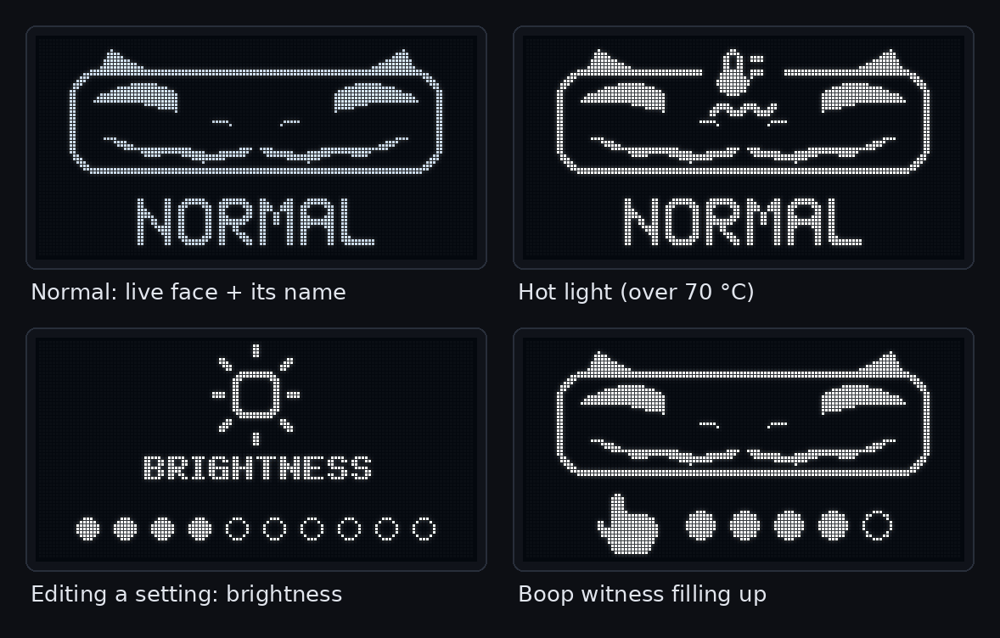
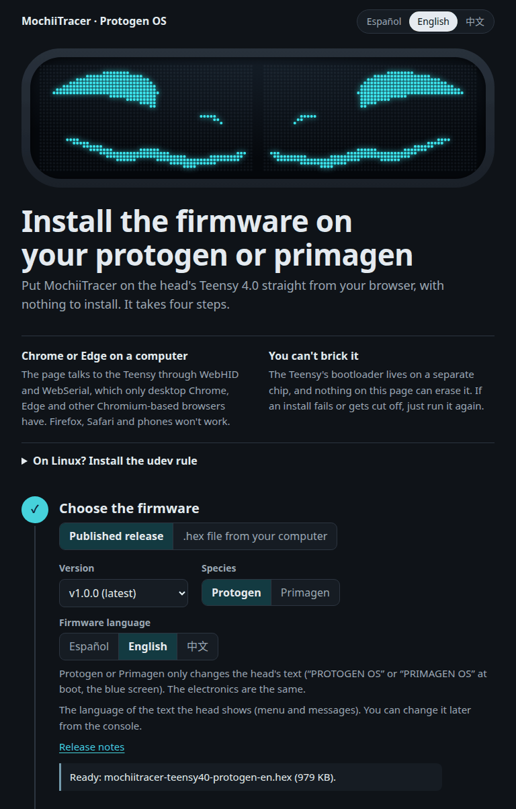

# MochiiTracer · Protogen OS

**English** · [Español](README.es.md) · [简体中文](README.zh-CN.md)

A fork of [ProtoTracer](https://github.com/coelacant1/ProtoTracer) by coelacant1 (AGPL-3.0) for
**Protogen and Primagen** heads. Both use the same electronics, so one firmware covers both.

By **Juls Denali / Tundra the furr / mochii the protogen**.


ProtoTracer is coelacant1's 3D engine that renders Protogen faces on LED matrices, and it does
all the heavy lifting here. MochiiTracer adds new faces, a boop gesture that doesn't trigger by
itself, a redesigned inner OLED, screens with readable text, three languages and a web
installer. It runs every day on a real head: a Teensy 4.0 on a Rhasky PROTO CONTROL V3 board
with two 64×32 HUB75 panels.

*Primagen* is the parent species of the Protogen, opened in 2026 by Zenith's Outer Reach. A
Primagen head has the same electronics behind a longer visor. If yours has a different panel
layout, see [Primagen visors and other panel layouts](#primagen-visors-and-other-panel-layouts).

**Contents:** [What's inside](#whats-inside) · [Install](#install) · [Using it](#using-it) ·
[Serial commands](#serial-commands) · [Hardware](#hardware) · [Tools](#tools-for-makers) ·
[Credits and license](#credits-and-license)

---

## What's inside

### 17 faces


*Rendered on a PC with the firmware's own ProtoTracer engine and face code, not photographed. AUDIO1 and AUDIO2 get a simulated voice.*

| # | Face | What you see | While booped |
|---|---|---|---|
| 0 | DEFAULT | The neutral stock face | Surprised |
| 1 | ANGRY | Angry eyes, red | Surprised |
| 2 | DOUBT | Skeptical look | Surprised |
| 3 | FROWN | Frown | Surprised |
| 4 | LOOKUP | Looking up | Surprised |
| 5 | SAD | Sad and frowning, blue | Surprised |
| 6 | BSOD | Parody blue screen across both panels (see below) | stays |
| 7 | LOWBAT | Blinking low-battery icon. It's a face you pick; it doesn't read your battery | stays |
| 8 | AUDIO1 | Audio-reactive gradient (stock ProtoTracer) | stays |
| 9 | AUDIO2 | Spectrum analyzer (stock ProtoTracer's AUDIO3) | stays |
| 10 | TACHA | Rainbow eyes, a little surprised | stays |
| 11 | KAOMOJI | Six kaomoji with white strobe flashes, 1 s loop ⚠️ | stays |
| 12 | KP140 | Pink phosphor kaomoji, one per beat with a fade, 140 BPM | stays |
| 13 | DEAD | x.x eyes; after 150 ms the mouth goes flat and sticks its tongue out | TACHA |
| 14 | AMOR | ♡ω♡ pink hearts that beat *ba-dum* every 0.9 s, ω mouth, blush | TACHA |
| 15 | OWO | O ω O ring eyes and an ω mouth; the transition spirals in | TACHA |
| 16 | HAPPY | ^‿^ closed arc eyes, big smile, blush | TACHA |

⚠️ **KAOMOJI flashes the whole visor white about six times per second.** Skip it around anyone
with photosensitive epilepsy.

DEAD, AMOR, OWO and HAPPY are native faces: new morph targets on the stock NukudeFlat mesh, not
videos, so they run as fast as the stock faces (about 75–80 FPS). They pause blinking and
ignore the microphone so your voice doesn't bend their mouths. Faces 0–5 and 13–16 use the
color you pick in the menu; ANGRY, SAD and AMOR keep their own.

### Boop + boooop: next face from the snout

Give the snout a short boop, let go, then boop again and **hold it for about 0.8 s**. The face
changes while your finger is still there, and only once per hold.

| Step | Timing |
|---|---|
| Nothing on the snout before | at least 0.4 s |
| 1st boop (a tap) | 60–350 ms |
| Let go | 80–400 ms |
| 2nd boop, held | 0.8 s → next face |

**A plain double tap does nothing, on purpose.** The old double-tap trigger kept firing on its
own. Friends boop in bursts, and hair, a hood or a hand resting on the snout make the proximity
sensor flicker. Two flickers within half a second look exactly like a double tap. A tap followed
by a deliberate hold almost never happens by accident. After a long contact (a hug, a hand
resting on the snout) the gesture waits for 2.5 s of real quiet before it arms again. The
sensor's baseline slowly absorbs a hand that stays put, so the sensor can't tell when you let
go. The timings and the reasoning behind them are in
`lib/ProtoTracer/Examples/Protogen/BoopGesture.h`.

### A face reacts while you boop it

While a finger is on the snout, faces 0–5 switch to the rainbow **Surprised** face, and DEAD,
AMOR, OWO and HAPPY switch to **TACHA** (rainbow eyes). They go back when you let go. Turning the
boop sensor off in the menu really turns this off. In stock ProtoTracer the face could stay
stuck on Surprised.

### The little visor: the OLED inside the head



The 128×64 OLED inside the head works like a car dashboard at night. It shows only what matters,
and it never shows a number.

- **Normal use:** a little visor drawing with the live face inside (both panels, the way people
  see them) and the face's name. Image faces show a pictogram instead.
- **Temperature light:** nothing while the Teensy's chip is fine. Above 70 °C, an "engine hot"
  light blinks gently and goes away below 65 °C. Above 80 °C, the whole visor lights up and blinks
  fast.
- **Settings** appear only while you're editing them with the button: a big icon, a short word
  and the value as dots (or an OFF/ON switch, or a word for colors and effects).
- **Boop witness:** while you do the boop + boooop, the name line turns into a hand and five dots
  that fill up. It becomes a lit bar with a check mark when the face changes. If you let go too
  early, the dots empty out. A stranger's single boop just fades away.
- It stays dim to keep your eyes comfortable, brightens for a moment when the face changes, and
  shifts by 1 px every minute so the screen doesn't burn in.
- **Power-on:** the OLED boots along with the LEDs, about 4 s. First ProtoTracer's AGPL credit
  for a moment, then the little visor wakes up and blinks while **PROTOGEN OS** (or
  **PRIMAGEN OS**) loads, smiles `^ ^` and says hello in its language (**HELLO!**, **¡HOLA!** or
  **你好！**).

### Boot screen: PROTOGEN OS


At power-on, "PROTOGEN OS" types itself out with a cursor. Then a pastel rainbow bar fills up,
gets stuck at 99% for a while (like they all do), flashes at 100% and fades into the face. It
takes about 4 seconds, and the OLED inside boots at the same time. A Primagen build says
**PRIMAGEN OS**.

### A parody blue screen with a working QR code


A blue screen drawn in code across both panels: a big `:(`, a percentage that counts up in
uneven jumps, **YOUR PROTOGEN NEEDS A BOOP** (or PRIMAGEN), and a real QR code you can scan.
At 100% it "reboots" by playing the boot screen, then starts over.

### Readable text on mirrored panels

The two panels are mirrored in software, so faces stay symmetric. Text screens (boot, blue
screen, the calibration pattern) are drawn panel by panel as seen from the front, so the text
reads left to right on both panels instead of coming out backwards on one of them. If that text
comes out with the panels swapped or mirrored, `k0`…`k3` fixes it (see
[Serial commands](#serial-commands)).

`k` only moves the text screens. Faces ignore it, because `HUB75Controller::Display()` always
puts the camera on one half of the chain and its mirror on the other. And bit 1 is a horizontal
mirror, so a panel mounted upside down (rotated 180°) isn't covered either: that takes a code
change in `HUB75Controller::Display()` and `FrontToLogical()`.

### Fans that actually reach 100%

The fan menu goes 0–9. Stock ProtoTracer multiplied that by 25, so level 9 sent 225/255 (88%) and
the fans never ran at full speed. Now 9 is a real 100%.

### No more phantom boops

The Adafruit APDS-9960 library's `readProximity()` returns 156 when the I²C read fails. That
looks like a finger on the snout, so the head got booped by nobody. The proximity register is
now read by hand. A failed read keeps the last good value and counts as an error (`i2cerr=` in
the status line).

### Three languages

The OLED speaks **Spanish** (the default), **English** or **Simplified Chinese**. To pick one:

- choose it in the web installer, or download the `.hex` for your language;
- on a head that's already running, send `l0` (es), `l1` (en) or `l2` (zh) over serial. The head
  saves it in EEPROM, so it survives power-offs and reflashing, and it **wins over the language
  the `.hex` was built with**. Send another `l<N>` to change it, or `l255` to go back to the
  `.hex`'s language;
- when building, use `-D IDIOMA_DEFECTO=0|1|2`.

---

## Install

Three ways, easiest first. All of them end with the same firmware.

### 1. Web installer (easiest)



1. Open **<https://mochiitheproto.github.io/mochiitracer/instalar/>** in **Chrome or Edge** on a
   computer. It uses WebHID and WebSerial, which Firefox, Safari and phones don't have.
2. Plug the Teensy in with a USB cable that carries data (some cables only charge).
3. Pick your species (Protogen or Primagen) and your language, then install. The page tries to
   reboot the Teensy into its bootloader by itself. If it can't, press the little button on the
   Teensy.

About the language: if you ever sent `l<N>` to this head, it keeps that language whatever the
`.hex` says. Change it with the language buttons in the installer's serial console, or send
`l255` to go back to the `.hex`'s language.

The page also has a serial console with the most useful commands.

**On Linux**, install PJRC's udev rule once, or the browser won't see the Teensy:

```bash
curl -fsSL https://www.pjrc.com/teensy/00-teensy.rules | sudo tee /etc/udev/rules.d/00-teensy.rules >/dev/null
sudo udevadm control --reload-rules && sudo udevadm trigger
```

### 2. Download the `.hex` and use Teensy Loader

1. On the [Releases page](https://github.com/mochiitheproto/mochiitracer/releases/latest),
   download the file for your head:

   | | Spanish | English | Chinese |
   |---|---|---|---|
   | **Protogen** | `mochiitracer-teensy40-protogen-es.hex` | `mochiitracer-teensy40-protogen-en.hex` | `mochiitracer-teensy40-protogen-zh.hex` |
   | **Primagen** | `mochiitracer-teensy40-primagen-es.hex` | `mochiitracer-teensy40-primagen-en.hex` | `mochiitracer-teensy40-primagen-zh.hex` |

   Each release also includes `SHA256SUMS`, to check your download with
   `sha256sum -c SHA256SUMS --ignore-missing`, `manifest.json`, which the web installer reads,
   the licenses of the Chinese pixel font that goes inside the firmware (`OFL-1.1-*.txt`) and
   the notices of the libraries compiled into it (`THIRD-PARTY-NOTICES.txt`, `LGPL-2.1.txt`).
2. Install PJRC's official [Teensy Loader](https://www.pjrc.com/teensy/loader.html). On Linux,
   install the udev rule from above too.
3. In Teensy Loader, open the `.hex` (*File → Open HEX File*) and press the button on the Teensy.
   With *Auto* on, it programs the Teensy and reboots it; otherwise click *Program* and then
   *Reboot*.

### 3. Build it with PlatformIO

You need [PlatformIO](https://platformio.org/) (the CLI or the VS Code extension). Always build
the `teensy40hub75` environment. A plain `pio run` also builds every other upstream
environment. `platformio.ini` pins the Teensy platform to `teensy@5.1.0` (GCC 11), the one the
releases are built with. Keep that pin: the newer `teensy` 6.x (GCC 15) can't build SmartMatrix
4.0.3.

```bash
git clone https://github.com/mochiitheproto/mochiitracer.git
cd mochiitracer
pio run -e teensy40hub75     # Protogen, Spanish → .pio/build/teensy40hub75/firmware.hex
```

To pick the language and species, add build flags:

| Flag | Values | Without it |
|---|---|---|
| `-D IDIOMA_DEFECTO=<N>` | `0` Spanish, `1` English, `2` Simplified Chinese | `0` |
| `-D ESPECIE_PRIMAGEN` | present or absent | Protogen |

For a one-off build:

```bash
PLATFORMIO_BUILD_FLAGS="-D IDIOMA_DEFECTO=1 -D ESPECIE_PRIMAGEN" pio run -e teensy40hub75
```

To keep it permanently, add your own environment to `platformio.ini`:

```ini
[env:my-head]
extends = env:teensy40hub75
build_flags =
    ${env:teensy40hub75.build_flags}
    -D IDIOMA_DEFECTO=1
    -D ESPECIE_PRIMAGEN
```

and build it with `pio run -e my-head` (the `.hex` ends up in `.pio/build/my-head/`).

Then flash `firmware.hex` with Teensy Loader or the web installer (it takes a local `.hex`), or
with `pio run -e teensy40hub75 -t upload` (`-e my-head` for your own environment). On a headless
machine, use `tools/flash.sh`. It calls `teensy_loader_cli` directly, because the PlatformIO
upload can fail silently without a desktop. `flash.sh` always builds `teensy40hub75`: for your
own environment, flash its output with `tools/flash.sh --hex .pio/build/my-head/firmware.hex`,
or pass the flags through `PLATFORMIO_BUILD_FLAGS` as above. If a change to a header doesn't
seem to take, run `pio run -t clean` and build again.

### Relax: you can't brick a Teensy

The Teensy's bootloader lives on a separate little chip that no firmware can overwrite. Whatever
you flash, pressing the button on the Teensy always brings back the bootloader, ready for
another `.hex`. Your settings live in EEPROM and survive reflashing. To wipe everything,
PJRC's "15-second restore" erases the Teensy and loads their blink program: hold the button
about 15 s and let go when the red LED flashes.

---

## Using it

### The button

The tested head has **one button** (pin 23). This is stock ProtoTracer behavior:

- **short press** → +1 on the current setting (it wraps around);
- **long press (more than 0.5 s)** → saves the setting and moves to the next of the **13 menus**.
  After the last one you're back at the faces.

While you're in a setting, the OLED shows it and the LED visor shows ProtoTracer's own menu,
with the face smaller.

| # | Menu | Values |
|---|---|---|
| 0 | Face | the 17 faces (short press = next face) |
| 1 | Brightness | 0–9 |
| 2 | Side brightness | 0–9 (ProtoTracer's APA102 accent strips) |
| 3 | Microphone | off / on (the mouth follows your voice) |
| 4 | Mic sensitivity | 0–9 |
| 5 | Boop sensor | off / on |
| 6 | Spectrum mirror | off / on (for AUDIO2) |
| 7 | Face size | 0–9 |
| 8 | Color | gradient, yellow, cyan, white, green, purple, red, blue, rainbow, nebula |
| 9 | Front hue | red, orange, yellow, lime, green, cyan, blue, indigo, purple, pink |
| 10 | Back hue | same list (front and back hues feed *gradient* and *nebula*) |
| 11 | Effect | none, wave ↕, wave ↔, radial wave, glitch, magnet\*, fisheye\*, blur ↔\*, blur ↕\*, radial blur\* |
| 12 | Fans | 0–9 (9 = 100%) |

Color 2 is **cyan** here. Stock ProtoTracer has orange in that slot.

\* Effects 5–9 (magnet, fisheye and the three blurs) do nothing yet: you can pick them and the
OLED names them, but the face doesn't change. Stock ProtoTracer ships them switched off
(`Menu::GetEffect()` returns the passthrough effect for them), and this fork leaves that as is.

### Serial commands

Plug the Teensy into a computer and open its USB serial port: the console in the web installer,
`pio device monitor`, or Arduino's Serial Monitor. Any baud rate works except **134**, which
reboots the Teensy into the bootloader (the web installer uses that on purpose).

Send **one command per line**, and the line has to be exactly the command. Anything else is
ignored, and so is any line longer than 7 characters. If you talk to the port with
`cat`/`echo` on Linux, run `stty -F /dev/ttyACM0 raw -echo` first. With echo on, the head
receives its own output back.

| Command | What it does | Saved? |
|---|---|---|
| `s` | Status line (see below) | |
| `f<N>` | Face N (0–16) | ✔ |
| `n` | Next face | ✔ |
| `b<N>` | Brightness 0–9 | ✔ |
| `l<N>` | OLED language: `l0` Spanish, `l1` English, `l2` Simplified Chinese. `l255` forgets it and goes back to the language the `.hex` was built with | ✔ |
| `k<N>` | Panel calibration for the text screens (boot, blue screen, `t`), 0–3: bit 0 swaps left/right, bit 1 mirrors horizontally. Faces ignore it | ✔ |
| `t` | Test pattern on/off, for calibrating: a red L on the left panel and a green R on the right one, both readable | |
| `B` | Play the boot screen again | |
| `o0` / `o1` | Screen off (fully black) / on. Brightness 0 still shows a little | |
| `d` | Capture what the camera rendered (64×32, hex) | |
| `v` | Capture what actually goes to the panels, seen from the front (128×32) | |
| `O` | Capture the OLED (128×64) | |
| `w<N>` | Pretend the chip is at N °C on the OLED, to test the temperature light (`w0` = real sensor) | |
| `g<N>` | A pretend finger for the boop gesture, no snout needed: `g1` boop + boooop, `g2` single boop, `g3` double tap, `g4` let go too early, `g5` hug, `g6` two boop + boooop in a row (the face changes twice), `g0` stop. Only the gesture sees it | |
| `p` / `q` | Boop scope on/off: one line per frame, `P <ms> <prox> <baseline> <booped> <i2c_errors>` | |
| `a1` / `a0` | Audio scope on/off: one line per frame with the loudness, the temperature and a 128-bin spectrum | |

Commands with a number answer `OK <cmd>` or `ERR <cmd>` (out of range, the boop sensor off,
or `g` during boot). "Saved" means EEPROM, just like the button, so it survives power-offs.
`o`, `w` and `g` don't survive a reset. One catch: if `g` fires the gesture, the face changes
just as it would with a real finger, and that face does get saved.

The status line starts with `S` and has `key=value` fields: `face` (number and name),
`bright`, `fan`, `pwm` (what the fans really get, 0–255), `boop`, `mic`, `color`, `i2cerr`
(failed boop-sensor reads), `cal`, `temp` (the Teensy chip, °C), `w`, `off`, `lang` and `t`
(ms since power-on).

---

## Hardware

### Tested

| Part | In the tested head | Notes |
|---|---|---|
| Microcontroller | Teensy 4.0 | `teensy41hub75` exists for the Teensy 4.1; it builds but hasn't been tried on a head |
| Board | Rhasky Workshops PROTO CONTROL V3 | It copies the HUB75 wiring of Pixelmatix's SmartLED Shield for Teensy 4 (V5), so boards that copy that shield should work too |
| Visor | 2 × HUB75 64×32 panels | SmartMatrix sees them as one 64×64 chain, one panel per half |
| Inner OLED | SSD1306 128×64, I²C `0x3C` | The code has an untested SH1106 path, but `-D SH1106` doesn't build as is: the `Adafruit_SH1106` library isn't in `lib_deps` |
| Boop sensor | APDS-9960, I²C `0x39` | Proximity only, on the snout |
| Fans | Noctua NF-A4x20 5V PWM | Any 5 V 4-pin PWM fan |
| Microphone | the one on the board | Analog |
| Button | one | |

The tested head's ear LEDs run on their own Bluetooth controller, not the Teensy. ProtoTracer's
APA102 accent output is still there, untouched and untested.

### Pinout (Teensy 4.0)

| Function | Pin |
|---|---|
| I²C SDA | 18 |
| I²C SCL | 19 |
| Button | 23 |
| Microphone (analog) | 22 |
| Fan PWM | 15 |
| HUB75 | same as the SmartLED Shield V5 (`MatrixHardware_Teensy4_ShieldV5.h` in SmartMatrix) |

The OLED and the boop sensor share the I²C bus. The OLED refreshes 5 times per second so the
bus stays free for the boop sensor.

**Before the first flash on a new board**, the `teensy40verifyhardware` environment scans the I²C
bus and tests the boop sensor and the OLED over serial. Its NeoTrellis test is turned off,
because it hangs forever if there's no NeoTrellis.

### Primagen visors and other panel layouts

If your Primagen (or Protogen) visor still has **two 64×32 HUB75 panels, one per side**, the
firmware works as is. Flash a `primagen` build and send `t`: you should read an L on the left
panel and an R on the right one. If they're swapped or mirrored, fix it with `k0`…`k3`. That
only straightens the text screens (boot, blue screen, `t`); faces ignore it. If a face comes
out wrong, or a panel is mounted upside down (rotated 180°), that's a code change in
`HUB75Controller::Display()` / `FrontToLogical()` (step 2 below).

If you chained more panels or different ones, build from source and adapt these places
(`lib/ProtoTracer/…`):

1. **`Controller/SmartMatrixHUB75.h`**: `kMatrixWidth` / `kMatrixHeight` set the size of the
   chain as SmartMatrix sees it (today 64×64 = two 64×32 panels stacked), and `kPanelType` sets
   the panel's scan type (`SM_PANELTYPE_HUB75_32ROW_MOD16SCAN`).
2. **`Controller/HUB75Controller.cpp`**: `Display()` copies the 64×32 camera into one panel and
   its mirror into the other, without going through the `k` calibration. `FrontToLogical()` maps
   "panel, x, y seen from the front" to the chain for the text screens, and that's where `k` is
   applied.
3. **`Camera/CameraManager/Implementations/HUB75DeltaCameras.h`**: the main camera
   `PixelGroup<2048>(Vector2D(192.0f, 96.0f), Vector2D(0.0f, 0.0f), 64)` is a 64×32 grid
   covering 192×96 scene units. Stock ProtoTracer also ships other layouts you can start from
   (`HUB75SplitCameras.h` + `HUB75ControllerSplit`, `HUB75Square.h` + `HUB75ControllerSquare`).
   The fork's extras (text screens, panel calibration, front-view capture) only exist in
   `HUB75Controller`.
4. **`Examples/Protogen/ProtogenHUB75Project.h`**: the constructor passes the camera bounds
   (`Vector2D(192.0f, 94.0f)`), `AlignObjectFace(pM.GetObject(), -7.5f)` fits the face into
   them, `SetMenuOffset` / `SetMenuSize` place ProtoTracer's LED menu, and the full-screen image
   faces use 192×94 planes.
5. The boot and blue screens (`Assets/Screens/`) draw 128×32 as seen from the front, and the OLED
   mini-visor, `tools/hostrender` and `tools/captura.py` assume 64×32 per side. Expect to adjust
   them too.

---

## Tools for makers

Everything is in `tools/`. Most code comments and tool docs are in Spanish (`tools/oledsim` is
documented in English). The development notes are in [`docs/LEARNINGS.md`](docs/LEARNINGS.md),
also in Spanish.

| Tool | What it's for |
|---|---|
| `flash.sh` | `flash.sh <name>` builds `teensy40hub75`, backs up the `.hex` (to `~/protogen-backup/`, or `PROTOGEN_BACKUP=`), checks its size, flashes with retries and checks the head comes back. `--hex file.hex` flashes a ready-made one, `--build-only` only builds |
| `captura.py` | Real captures from the head to PNG over serial: the face, what goes to the panels (`--vista`), the boot (`--boot`), the OLED (`--oled`), the boop gesture with a pretend finger (`--gesto N`) |
| `hostrender/` | The **real** ProtoTracer engine compiled on your computer. Design morph faces without flashing: vertex maps, recipes, transitions, and C++ ready to paste. Checked pixel by pixel against captures from the head |
| `oledsim/` | Simulator of the inner OLED: runs the real HUD code and the real Adafruit driver against an emulated SSD1306 |
| `oled/` | Reproducible generator for the OLED's icons and fonts (`gen_assets.py` → `SoftAssets.*`) |
| `convert_webp_to_sequence.py` | Animated WebP/GIF → face (`ImageSequence` header) |
| `generate_video.py` | Video frames (PNG from ffmpeg) → face with a seamless loop |
| `generate_kaomoji.py`, `generate_kaomoji_bpm.py` | The generators of the bundled KAOMOJI and KP140 faces |
| `generate_smile.py`, `generate_eyes.py` | Generic examples, image → animation: `generate_smile.py` turns a picture into a 140 BPM strobe or fade loop, `generate_eyes.py` takes a reference image's palette for animated pop-art eyes. No bundled face uses them |
| `generate_test_grid.py` | Generates `TestGrid.h`, a 64×32 calibration grid (colored corners, an L to spot mirroring). Not a face, and not the `t` pattern |
| `led_preview.html` | Crop an image or GIF to 64×32 and preview it as LEDs in the browser |
| `grabar-boop.sh`, `grabar-audio.sh` | Record the boop or audio scope to a file, surviving USB dropouts |
| `apagada-hasta.py` | Keeps the screen off until a given time (`HH:MM`) |

The serial tools find the Teensy on their own (`/dev/serial/by-id/usb-Teensyduino_USB_Serial_*`).
With two Teensys connected they stop with a clear error. `TEENSY_PORT=` (or `--puerto`) picks
one.

### Make your own face

1. **Frames:** an animated GIF/WebP goes through `tools/convert_webp_to_sequence.py in.webp MyFace
   MyFace.h`. For a video, take 64×32 frames with ffmpeg (`-vf "crop=…,fps=9,scale=64:32"`) and
   run `tools/generate_video.py frames/ MyFace.h --class-name MyFace --overlap 12`. Try the crop
   in `tools/led_preview.html` first.
2. Put the header in its own folder under `lib/ProtoTracer/Assets/Textures/Animated/`.
3. In `ProtogenHUB75Project.h`, add the `#include`, a member (copy `kaoPink140Anim`), a face
   method (copy `KaomojiFace()`), its name in `faceArray`, and a `case` in `SelectFace()`.
4. `faceArray` has a fixed size: raise it by one (`faceArray[17]` → `faceArray[18]`). From
   there the menu, the OLED and `f<N>` count the faces by themselves.
5. Add it **at the end** (index 17). If you insert it in the middle, renumber the `case`s after
   it, and fix the boop reaction in `SelectFace()`: its ranges are fixed numbers (`code < 6` →
   Surprised, `code >= 13 && code <= 16` → TACHA), so they'd land on the wrong faces.
6. Optional: give it a translated name for the OLED in `tools/oled/textos.py` and run
   `tools/oled/gen_assets.py` (see `tools/oled/fonts/README.md`). Without that the OLED shows its
   `faceArray` name as is, and its Latin font only has capital letters, so name the face in caps.
7. Faces made of morphs (like DEAD or HAPPY) are designed with `tools/hostrender`.
8. Watch the size: `teensy_loader_cli` (used by `flash.sh`) can't read a `.hex` over 65,536
   lines, and each 64×32 frame costs about 128 lines.

---

## Credits and license

- **[ProtoTracer](https://github.com/coelacant1/ProtoTracer)** by coelacant1 (Coela Can't):
  the engine, the NukudeFlat face, the menu and the base project. AGPL-3.0. Its original README
  is in [`docs/README-upstream.md`](docs/README-upstream.md). The web installer is adapted from
  coelacant1's firmware uploader.
- **Libraries** (PlatformIO downloads them, and each keeps its own license): Adafruit (GFX,
  SSD1306, APDS9960, BusIO, Unified Sensor, BNO055, seesaw, MMC56x3); SmartMatrix by Pixelmatix
  (Louis Beaudoin); PJRC's Teensyduino core, OctoWS2811, SPI, Wire and EEPROM (Paul Stoffregen);
  Teensy_ADC (pedvide); SerialTransfer (PowerBroker2). `led_preview.html` loads gifuct-js from a
  CDN. The OLED simulator carries copies of a few Teensyduino core files in
  `tools/oledsim/shim/`, under their own licenses (see [`NOTICE.md`](NOTICE.md)). The release
  `.hex` files contain compiled code from the Teensyduino core, Adafruit GFX, SSD1306, APDS9960
  and BusIO, and SmartMatrix; their notices ship with every release in
  [`THIRD-PARTY-NOTICES.txt`](THIRD-PARTY-NOTICES.txt).
- **Fonts:** the OLED's 5×7 Latin font and the LEDs' 3×5 font were drawn by hand for this
  project. Chinese glyphs: [Fusion Pixel Font](https://github.com/TakWolf/fusion-pixel-font)
  12px zh_hans by TakWolf (glyphs from Ark Pixel Font and Cubic 11), SIL Open Font License 1.1.
  The subset and the licenses are in `tools/oled/fonts/`.
- Protogen and Primagen are species created by Malice-risu, part of the Zenith's Outer Reach
  (ZOR) universe. This is a fan-made firmware, not affiliated with or endorsed by them or ZOR;
  the names only say which heads it's for.

MochiiTracer is distributed under the same license as ProtoTracer, the
[GNU Affero General Public License v3.0](LICENSE). [`NOTICE.md`](NOTICE.md) lists what this fork
changed. If you share a modified version (a `.hex`, a head you sell, a page that serves it),
share its source under the AGPL too.

**As is, with love.** It works on our head every day, and issues and pull requests are welcome,
but there's no guaranteed support and no warranty. Please be careful with power: at full
brightness HUB75 panels can draw several amps, so give them a proper 5 V supply.
