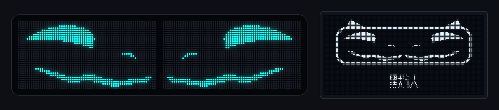
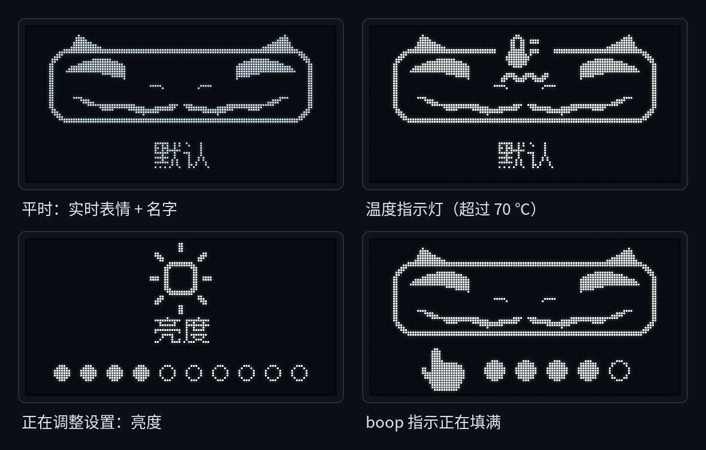
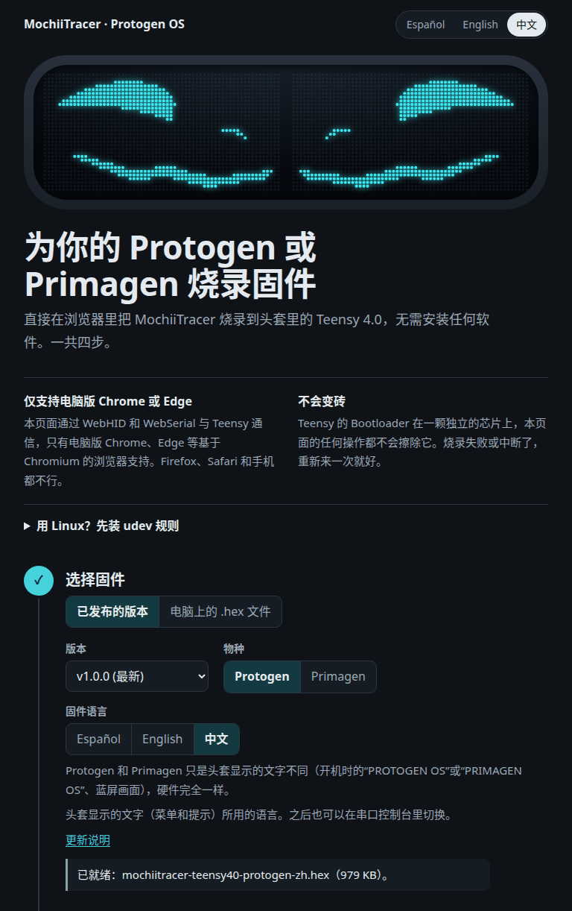

# MochiiTracer · Protogen OS

[English](README.md) · [Español](README.es.md) · **简体中文**

本项目是 coelacant1 的 [ProtoTracer](https://github.com/coelacant1/ProtoTracer)（AGPL-3.0）的分支，适用于 **Protogen 和 Primagen** 头套。两者的电子部分完全相同，所以同一份固件两种都能用。

作者：**Juls Denali / Tundra the furr / mochii the protogen**。



ProtoTracer 是 coelacant1 写的 3D 引擎，负责在 LED 点阵上渲染 Protogen 的表情，核心工作都是它完成的。MochiiTracer 在此基础上增加了：新表情、不会自己乱触发的 boop 手势、重新设计的内部小屏、文字能正常阅读的屏幕、三种语言，以及网页烧录工具。我们每天都在一个真实的头套上使用它：Teensy 4.0 装在 Rhasky PROTO CONTROL V3 主板上，配两块 64×32 的 HUB75 屏。

*Primagen* 是 Protogen 的起源物种，2026 年由 Zenith's Outer Reach 开放。Primagen 头套用的是同样的电子部分，只是面罩更长。如果你的屏幕排布不一样，请看[Primagen 面罩与其他屏幕排布](#primagen-面罩与其他屏幕排布)。

**目录**：[功能一览](#功能一览) · [安装](#安装) · [使用方法](#使用方法) · [串口命令](#串口命令) · [硬件](#硬件) · [给动手党的工具](#给动手党的工具) · [致谢与许可证](#致谢与许可证)

---

## 功能一览

### 17 个表情


*在电脑上用固件本身的 ProtoTracer 引擎和表情代码渲染，不是照片。AUDIO1 和 AUDIO2 用的是模拟的人声。*

| # | 表情 | 效果 | 被 boop 时 |
|---|---|---|---|
| 0 | DEFAULT | 原版的中性表情 | 惊讶 |
| 1 | ANGRY | 生气的眼睛，红色 | 惊讶 |
| 2 | DOUBT | 怀疑的眼神 | 惊讶 |
| 3 | FROWN | 撇嘴 | 惊讶 |
| 4 | LOOKUP | 往上看 | 惊讶 |
| 5 | SAD | 难过又撇嘴，蓝色 | 惊讶 |
| 6 | BSOD | 横跨两块屏的恶搞蓝屏（见下文） | 不变 |
| 7 | LOWBAT | 闪烁的低电量图标。这只是一个可以手动选的表情，不会读取你的电池电量 | 不变 |
| 8 | AUDIO1 | 随声音变化的渐变色（ProtoTracer 原版） | 不变 |
| 9 | AUDIO2 | 频谱分析仪（ProtoTracer 原版的 AUDIO3） | 不变 |
| 10 | TACHA | 彩虹眼，带点惊讶 | 不变 |
| 11 | KAOMOJI | 六个颜文字配白色频闪，1 秒一循环 ⚠️ | 不变 |
| 12 | KP140 | 荧光粉色颜文字，每拍一个、带渐隐，140 BPM | 不变 |
| 13 | DEAD | x.x 眼；150 毫秒后嘴变成一条线，再吐出舌头 | TACHA |
| 14 | AMOR | ♡ω♡ 粉色爱心每 0.9 秒“扑通”跳一下，ω 嘴，脸红 | TACHA |
| 15 | OWO | O ω O 圆环眼加 ω 嘴，切换时会转着圈出现 | TACHA |
| 16 | HAPPY | ^‿^ 弯弯的闭眼，大笑脸，脸红 | TACHA |

⚠️ **KAOMOJI 每秒会让整个面罩闪白大约六次。** 身边有光敏性癫痫的人时请不要使用。

DEAD、AMOR、OWO 和 HAPPY 是原生表情：它们是在原版 NukudeFlat 网格上新增的变形目标（morph），不是视频，所以和原版表情一样流畅（约 75–80 FPS）。使用这几个表情时会暂停眨眼，也不理会麦克风，免得你说话把嘴型弄乱。0–5 号和 13–16 号表情使用菜单里选的颜色，ANGRY、SAD 和 AMOR 有自己固定的颜色。

### Boop + boooop：用鼻子切换下一个表情

先在鼻子上轻轻点一下（boop），松开，再点一下并**按住大约 0.8 秒**。手指还没离开，表情就会切换，而且每按住一次只切换一次。

| 步骤 | 时间 |
|---|---|
| 之前鼻子上没有东西 | 至少 0.4 秒 |
| 第一下（轻点） | 60–350 毫秒 |
| 松开 | 80–400 毫秒 |
| 第二下，按住 | 0.8 秒 → 下一个表情 |

**单纯的双击不会有任何反应，这是故意的。** 以前用双击切换时，表情经常自己乱换：朋友们会连续 boop，头发、帽兜或搭在鼻子上的手都会让接近传感器忽闪，半秒内的两次忽闪看起来和双击一模一样。而“轻点一下，再刻意按住”几乎不会误触发。长时间接触后（拥抱、手一直搭在鼻子上），手势要等真正安静 2.5 秒才会重新待命。传感器的基准值会慢慢把一直不动的手“吸收”掉，所以传感器分辨不出你什么时候松手。具体时间和设计理由写在 `lib/ProtoTracer/Examples/Protogen/BoopGesture.h` 里。

### 被 boop 时表情会有反应

手指放在鼻子上的时候，0–5 号表情会变成彩虹色的**惊讶**脸，DEAD、AMOR、OWO 和 HAPPY 会变成 **TACHA**（彩虹眼），松手后恢复原样。在菜单里关掉 boop 传感器后，这个反应就真的关掉了。在原版 ProtoTracer 里，表情可能会一直卡在惊讶脸上。

### 小面罩：头套里面的 OLED



头套内部的 128×64 OLED 像夜间的汽车仪表盘一样，只显示重要的东西，而且从不显示数字。

- **平时**：一个画出来的小面罩，里面是实时的表情（两块屏，和别人看到的一样），下面是表情名字。图片类表情会显示一个小图标。
- **温度指示灯**：Teensy 芯片温度正常时什么都不显示。超过 70 °C，一个“发动机过热”的灯会慢慢闪，降到 65 °C 以下熄灭。超过 80 °C，整个小面罩亮起并快速闪烁。
- **设置**：只有在用按钮调整时才出现，显示一个大图标、一个简短的词，数值用小圆点表示（或者是“关/开”开关，颜色和特效则直接显示名称）。
- **boop 指示**：做 boop + boooop 时，名字那一行会变成一只小手和五个逐渐填满的圆点。表情切换时变成一条亮起的进度条和一个对勾。如果你松手太早，圆点会清空。别人随手的单次 boop 只会悄悄消失。
- 平时亮度较低，不刺眼；切换表情时会短暂变亮；每分钟移动 1 像素，防止烧屏。
- **开机**：OLED 和 LED 一起启动，大约 4 秒。先短暂显示 ProtoTracer 的 AGPL 致谢，接着小面罩“醒来”并眨眨眼，同时加载 **PROTOGEN OS**（或 **PRIMAGEN OS**），最后笑成 `^ ^`，用当前语言打招呼（**你好！**、**HELLO!** 或 **¡HOLA!**）。

### 开机画面：PROTOGEN OS


开机时，“PROTOGEN OS” 会像打字机一样带着光标逐字出现。接着一条粉彩彩虹进度条慢慢填满，在 99% 卡上好一会儿（进度条都这样），到 100% 时闪一下，然后淡入表情。整个过程大约 4 秒，内部的 OLED 也同时启动。为 Primagen 编译的版本会显示 **PRIMAGEN OS**。

### 带可用二维码的恶搞蓝屏


一个用代码画出来、横跨两块屏的蓝屏：一个大大的 `:(`、一个跳着往上涨的百分比、**YOUR PROTOGEN NEEDS A BOOP**（或 PRIMAGEN），还有一个真的能扫的二维码。到 100% 时会播放开机画面“重启”，然后从头再来。

### 镜像屏幕上的文字也是正的

两块屏是由软件做镜像的，这样表情才是对称的。带文字的画面（开机画面、蓝屏、校准图案）则按正面视角逐块屏绘制，所以两块屏上的文字都是从左往右读，而不是其中一块反着显示。如果这些文字所在的两块屏左右颠倒或者成了镜像，用 `k0`…`k3` 就能修正（见[串口命令](#串口命令)）。

`k` 只调整带文字的画面。表情不受它影响，因为 `HUB75Controller::Display()` 总是把摄像机画面放在屏链的一半，把它的镜像放在另一半。而且第 1 位只是水平镜像，所以倒装（旋转 180°）的屏也没法用 `k` 修正：那需要修改 `HUB75Controller::Display()` 和 `FrontToLogical()` 的代码。

### 风扇真的能到 100%

风扇菜单是 0–9 档。原版 ProtoTracer 把档位乘以 25，所以 9 档只输出 225/255（88%），风扇永远到不了全速。现在 9 档就是真正的 100%。

### 告别“幽灵 boop”

Adafruit 的 APDS-9960 库里，`readProximity()` 在 I²C 读取失败时会返回 156。这看起来就像鼻子上有手指，于是头套会被“空气”boop。现在改为手动读取接近传感器的寄存器。读取失败时保留上一次的正常值，并记为一次错误（状态行里的 `i2cerr=`）。

### 三种语言

OLED 可以显示**西班牙语**（默认）、**英语**或**简体中文**。设置方法：

- 在网页烧录工具里选，或者下载对应语言的 `.hex`；
- 头套已经在运行时，通过串口发送 `l0`（西班牙语）、`l1`（英语）或 `l2`（中文）。头套会把它存进 EEPROM，断电和重新烧录后都会保留，而且**优先于 `.hex` 编译时的语言**。想换的话再发一次 `l<N>`，或者发 `l255` 回到 `.hex` 的语言；
- 自己编译时，用 `-D IDIOMA_DEFECTO=0|1|2`。

---

## 安装

有三种方法，从最简单的开始。三种方法装上的都是同一个固件。

### 1. 网页烧录工具（最简单）



1. 在电脑上用 **Chrome 或 Edge** 打开 **<https://mochiitheproto.github.io/mochiitracer/instalar/>**。它用的是 WebHID 和 WebSerial，Firefox、Safari 和手机都不支持。
2. 用能传数据的 USB 线连接 Teensy（有些线只能充电）。
3. 选择物种（Protogen 或 Primagen）和语言，然后开始安装。页面会尝试自动让 Teensy 进入引导程序（bootloader）。如果不行，按一下 Teensy 上的小按钮。

关于语言：如果你曾经给这个头套发过 `l<N>`，不管 `.hex` 是什么语言，它都会保留那个语言。可以用烧录工具串口控制台里的语言按钮来换，或者发送 `l255` 回到 `.hex` 的语言。

页面里还有一个串口控制台，可以发送最常用的命令。

**Linux 用户**需要先装一次 PJRC 的 udev 规则，否则浏览器找不到 Teensy：

```bash
curl -fsSL https://www.pjrc.com/teensy/00-teensy.rules | sudo tee /etc/udev/rules.d/00-teensy.rules >/dev/null
sudo udevadm control --reload-rules && sudo udevadm trigger
```

### 2. 下载 `.hex`，用 Teensy Loader 烧录

1. 在 [Releases 页面](https://github.com/mochiitheproto/mochiitracer/releases/latest) 下载适合你头套的文件：

   | | 西班牙语 | 英语 | 中文 |
   |---|---|---|---|
   | **Protogen** | `mochiitracer-teensy40-protogen-es.hex` | `mochiitracer-teensy40-protogen-en.hex` | `mochiitracer-teensy40-protogen-zh.hex` |
   | **Primagen** | `mochiitracer-teensy40-primagen-es.hex` | `mochiitracer-teensy40-primagen-en.hex` | `mochiitracer-teensy40-primagen-zh.hex` |

   每个版本还附带 `SHA256SUMS`、`manifest.json`（给网页烧录工具用）、固件里内置的中文像素字体的许可证（`OFL-1.1-*.txt`），以及编译进固件的依赖库的版权声明（`THIRD-PARTY-NOTICES.txt`、`LGPL-2.1.txt`）。可以用 `sha256sum -c SHA256SUMS --ignore-missing` 校验下载的文件。
2. 安装 PJRC 官方的 [Teensy Loader](https://www.pjrc.com/teensy/loader.html)。Linux 上也要装上面的 udev 规则。
3. 在 Teensy Loader 里打开 `.hex`（*File → Open HEX File*），然后按一下 Teensy 上的按钮。开着 *Auto* 时它会自动烧录并重启；否则先点 *Program* 再点 *Reboot*。

### 3. 用 PlatformIO 编译

需要安装 [PlatformIO](https://platformio.org/)（命令行或 VS Code 插件都行）。请始终编译 `teensy40hub75` 环境。直接运行 `pio run` 会把上游的其他环境也全部编译一遍。`platformio.ini` 把 Teensy 平台固定为 `teensy@5.1.0`（GCC 11），发布版也是用它编译的。请保留这个版本：更新的 `teensy` 6.x（GCC 15）编译不了 SmartMatrix 4.0.3。

```bash
git clone https://github.com/mochiitheproto/mochiitracer.git
cd mochiitracer
pio run -e teensy40hub75     # Protogen、西班牙语 → .pio/build/teensy40hub75/firmware.hex
```

语言和物种通过编译参数来选：

| 参数 | 取值 | 不加时 |
|---|---|---|
| `-D IDIOMA_DEFECTO=<N>` | `0` 西班牙语、`1` 英语、`2` 简体中文 | `0` |
| `-D ESPECIE_PRIMAGEN` | 加或不加 | Protogen |

临时编译一次：

```bash
PLATFORMIO_BUILD_FLAGS="-D IDIOMA_DEFECTO=2 -D ESPECIE_PRIMAGEN" pio run -e teensy40hub75
```

如果想固定下来，在 `platformio.ini` 里加一个自己的环境：

```ini
[env:my-head]
extends = env:teensy40hub75
build_flags =
    ${env:teensy40hub75.build_flags}
    -D IDIOMA_DEFECTO=2
    -D ESPECIE_PRIMAGEN
```

然后用 `pio run -e my-head` 编译（`.hex` 在 `.pio/build/my-head/` 里）。

之后用 Teensy Loader 或网页烧录工具（它也能用电脑上的 `.hex`）烧录 `firmware.hex`，或者运行 `pio run -e teensy40hub75 -t upload`（自己的环境就用 `-e my-head`）。在没有图形界面的机器上请用 `tools/flash.sh`。它直接调用 `teensy_loader_cli`，因为没有桌面环境时 PlatformIO 的上传可能会悄悄失败。`flash.sh` 总是编译 `teensy40hub75`：如果用的是自己的环境，就用 `tools/flash.sh --hex .pio/build/my-head/firmware.hex` 烧录编译结果，或者像上面那样通过 `PLATFORMIO_BUILD_FLAGS` 传参数。如果改了头文件却好像没生效，先运行 `pio run -t clean` 再重新编译。

### 放心：Teensy 是刷不坏的

Teensy 的引导程序在另一颗独立的小芯片上，任何固件都覆盖不了它。不管你烧了什么，只要按一下 Teensy 上的按钮，就会回到引导程序，可以重新烧录。你的设置存在 EEPROM 里，重新烧录后也会保留。如果想彻底清空，PJRC 的“15 秒恢复”会擦除整个 Teensy 并装上官方的 LED 闪烁程序：按住按钮大约 15 秒，等红色 LED 闪一下时松开。

---

## 使用方法

### 按钮

测试用的头套只有**一个按钮**（23 号引脚）。按钮的行为和原版 ProtoTracer 一样：

- **短按** → 当前设置 +1（到头后从头开始）；
- **长按（超过 0.5 秒）** → 保存当前设置，并进入 **13 个菜单**中的下一个。最后一个之后会回到表情。

在调整某个设置时，OLED 会显示它，LED 面罩上则显示 ProtoTracer 自带的菜单，表情会缩小。

| # | 菜单 | 取值 |
|---|---|---|
| 0 | 表情 | 17 个表情（短按 = 下一个表情） |
| 1 | 亮度 | 0–9 |
| 2 | 侧灯亮度 | 0–9（ProtoTracer 的 APA102 装饰灯带） |
| 3 | 麦克风 | 关 / 开（嘴型跟着你的声音动） |
| 4 | 麦克风灵敏度 | 0–9 |
| 5 | boop 传感器 | 关 / 开 |
| 6 | 频谱镜像 | 关 / 开（用于 AUDIO2） |
| 7 | 表情大小 | 0–9 |
| 8 | 颜色 | 渐变、黄、青、白、绿、紫、红、蓝、彩虹、星云 |
| 9 | 前色调 | 红、橙、黄、青柠、绿、青、蓝、靛、紫、粉 |
| 10 | 后色调 | 同上（前后两个色调用于*渐变*和*星云*） |
| 11 | 特效 | 无、波浪 ↕、波浪 ↔、径向波浪、故障风、磁铁\*、鱼眼\*、模糊 ↔\*、模糊 ↕\*、径向模糊\* |
| 12 | 风扇 | 0–9（9 = 100%） |

这里 2 号颜色是**青色**，原版 ProtoTracer 这个位置是橙色。

\* 5–9 号特效（磁铁、鱼眼和三种模糊）目前没有任何效果：可以选，OLED 也会显示名字，但表情不会变。原版 ProtoTracer 出厂时就把它们关掉了（`Menu::GetEffect()` 对它们返回什么都不做的 passthrough 特效），本分支保持原样。

### 串口命令

把 Teensy 连到电脑上，打开它的 USB 串口：可以用网页烧录工具里的控制台、`pio device monitor` 或 Arduino 的串口监视器。任何波特率都可以，只有 **134** 例外：它会让 Teensy 重启进入引导程序（网页烧录工具就是故意这么用的）。

**每行发送一个命令**，而且整行必须正好是这个命令。其他内容都会被忽略，超过 7 个字符的行也一样。如果你在 Linux 上用 `cat`/`echo` 直接读写串口，先运行 `stty -F /dev/ttyACM0 raw -echo`。如果开着回显，头套会把自己打印的内容又收回去。

| 命令 | 作用 | 会保存？ |
|---|---|---|
| `s` | 状态行（见下文） | |
| `f<N>` | 切换到第 N 个表情（0–16） | ✔ |
| `n` | 下一个表情 | ✔ |
| `b<N>` | 亮度 0–9 | ✔ |
| `l<N>` | OLED 语言：`l0` 西班牙语、`l1` 英语、`l2` 简体中文。`l255` 清除设置，回到 `.hex` 编译时的语言 | ✔ |
| `k<N>` | 带文字画面（开机画面、蓝屏、`t`）的屏幕校准 0–3：第 0 位交换左右，第 1 位水平镜像。表情不受影响 | ✔ |
| `t` | 开/关校准用的测试图案：左边的屏显示红色的 L，右边的屏显示绿色的 R，两个字母都是正的 | |
| `B` | 重新播放开机画面 | |
| `o0` / `o1` | 关屏（全黑）/ 开屏。亮度 0 时仍然能看到一点光 | |
| `d` | 抓取摄像机渲染的画面（64×32，十六进制） | |
| `v` | 抓取实际发到屏幕上的画面，正面视角（128×32） | |
| `O` | 抓取 OLED 画面（128×64） | |
| `w<N>` | 让 OLED 以为芯片温度是 N °C，用来测试温度指示灯（`w0` = 用真实传感器） | |
| `g<N>` | 模拟手指来测试 boop 手势，不用碰鼻子：`g1` boop + boooop、`g2` 单次 boop、`g3` 双击、`g4` 太早松手、`g5` 拥抱、`g6` 连续两次 boop + boooop（表情会换两次）、`g0` 停止。只有手势检测能看到它 | |
| `p` / `q` | 开/关 boop 示波器：每帧一行，`P <毫秒> <接近值> <基准值> <是否被boop> <I2C错误数>` | |
| `a1` / `a0` | 开/关音频示波器：每帧一行，包含音量、温度和 128 段频谱 | |

带数字的命令会回复 `OK <命令>` 或 `ERR <命令>`（超出范围、boop 传感器已关闭，或者在开机画面期间发送 `g`）。“会保存”指的是存进 EEPROM，和用按钮调整一样，断电也会保留。`o`、`w` 和 `g` 重启后就失效。注意：如果 `g` 触发了手势，表情会像真手指触发一样切换，而切换后的表情是会保存的。

状态行以 `S` 开头，由 `键=值` 组成：`face`（编号和名字）、`bright`、`fan`、`pwm`（风扇实际收到的值，0–255）、`boop`、`mic`、`color`、`i2cerr`（boop 传感器读取失败的次数）、`cal`、`temp`（Teensy 芯片温度，°C）、`w`、`off`、`lang` 和 `t`（开机后的毫秒数）。

---

## 硬件

### 已测试

| 部件 | 测试头套里用的 | 备注 |
|---|---|---|
| 微控制器 | Teensy 4.0 | 有给 Teensy 4.1 用的 `teensy41hub75` 环境，能编译，但还没在头套上试过 |
| 主板 | Rhasky Workshops PROTO CONTROL V3 | 它沿用了 Pixelmatix 的 SmartLED Shield for Teensy 4（V5）的 HUB75 接线，所以照搬这款扩展板的主板应该也能用 |
| 面罩 | 2 块 64×32 HUB75 屏 | SmartMatrix 把它们当成一条 64×64 的链，每块屏占一半 |
| 内部 OLED | SSD1306 128×64，I²C `0x3C` | 代码里有一条未经测试的 SH1106 路径，但 `-D SH1106` 现在编译不过：`lib_deps` 里没有 `Adafruit_SH1106` 库 |
| boop 传感器 | APDS-9960，I²C `0x39` | 只用接近检测，装在鼻子上 |
| 风扇 | Noctua NF-A4x20 5V PWM | 任何 5 V 四针 PWM 风扇都行 |
| 麦克风 | 主板自带的 | 模拟信号 |
| 按钮 | 一个 | |

测试头套的耳朵灯用的是独立的蓝牙控制器，不由 Teensy 控制。ProtoTracer 的 APA102 装饰灯输出还在，没改动，也没测试。

### 引脚（Teensy 4.0）

| 功能 | 引脚 |
|---|---|
| I²C SDA | 18 |
| I²C SCL | 19 |
| 按钮 | 23 |
| 麦克风（模拟） | 22 |
| 风扇 PWM | 15 |
| HUB75 | 与 SmartLED Shield V5 相同（SmartMatrix 里的 `MatrixHardware_Teensy4_ShieldV5.h`） |

OLED 和 boop 传感器共用 I²C 总线。OLED 每秒刷新 5 次，好把总线留给 boop 传感器。

**在新主板上第一次烧录之前**，可以先用 `teensy40verifyhardware` 环境：它会扫描 I²C 总线，并通过串口测试 boop 传感器和 OLED。其中的 NeoTrellis 测试已关闭，因为没有 NeoTrellis 时它会永远卡住。

### Primagen 面罩与其他屏幕排布

如果你的 Primagen（或 Protogen）面罩仍然是**两块 64×32 HUB75 屏、每边一块**，固件可以直接用。烧录 `primagen` 版本，然后发送 `t`：左边的屏应该显示 L，右边的屏显示 R。如果左右颠倒或者成了镜像，用 `k0`…`k3` 修正。这只会把带文字的画面（开机画面、蓝屏、`t`）摆正，表情不受影响。如果表情显示不对，或者某块屏是倒装的（旋转 180°），就需要修改 `HUB75Controller::Display()` / `FrontToLogical()` 的代码（见下面第 2 步）。

如果你串了更多的屏或者不同的屏，需要从源码编译，并修改下面这些地方（`lib/ProtoTracer/…`）：

1. **`Controller/SmartMatrixHUB75.h`**：`kMatrixWidth` / `kMatrixHeight` 是 SmartMatrix 眼中整条屏链的尺寸（现在是 64×64，即两块 64×32 叠在一起），`kPanelType` 是屏的扫描方式（`SM_PANELTYPE_HUB75_32ROW_MOD16SCAN`）。
2. **`Controller/HUB75Controller.cpp`**：`Display()` 把 64×32 的摄像机画面复制到一块屏，再把镜像复制到另一块，这一步不经过 `k` 校准。`FrontToLogical()` 负责把“正面视角下的屏、x、y”换算到屏链上，供文字画面使用，`k` 校准就是在这里生效的。
3. **`Camera/CameraManager/Implementations/HUB75DeltaCameras.h`**：主摄像机 `PixelGroup<2048>(Vector2D(192.0f, 96.0f), Vector2D(0.0f, 0.0f), 64)` 是一个 64×32 的网格，覆盖场景里 192×96 的范围。原版 ProtoTracer 还提供了其他排布可以作为起点（`HUB75SplitCameras.h` + `HUB75ControllerSplit`、`HUB75Square.h` + `HUB75ControllerSquare`）。本分支新增的功能（文字画面、屏幕校准、正面视角抓图）只在 `HUB75Controller` 里有。
4. **`Examples/Protogen/ProtogenHUB75Project.h`**：构造函数传入摄像机的边界（`Vector2D(192.0f, 94.0f)`），`AlignObjectFace(pM.GetObject(), -7.5f)` 把表情放进这个范围，`SetMenuOffset` / `SetMenuSize` 决定 ProtoTracer 的 LED 菜单的位置，全屏图片类表情用的是 192×94 的平面。
5. 开机画面和蓝屏（`Assets/Screens/`）按正面视角绘制 128×32；OLED 的小面罩、`tools/hostrender` 和 `tools/captura.py` 都假定每边是 64×32。这些也需要相应调整。

---

## 给动手党的工具

所有工具都在 `tools/` 里。大部分代码注释和工具文档是西班牙语（`tools/oledsim` 的文档是英语）。开发笔记在 [`docs/LEARNINGS.md`](docs/LEARNINGS.md)，也是西班牙语。

| 工具 | 用途 |
|---|---|
| `flash.sh` | `flash.sh <名字>` 编译 `teensy40hub75`、备份 `.hex`（存到 `~/protogen-backup/`，或用 `PROTOGEN_BACKUP=` 指定）、检查大小、带重试地烧录，并确认头套正常回来。`--hex 文件.hex` 烧录现成的文件，`--build-only` 只编译 |
| `captura.py` | 通过串口从头套上抓取真实画面并存成 PNG：表情、实际发到屏幕的画面（`--vista`）、开机过程（`--boot`）、OLED（`--oled`）、用模拟手指测试 boop 手势（`--gesto N`） |
| `hostrender/` | 在你的电脑上编译运行的**真正的** ProtoTracer 引擎。不用烧录就能设计变形表情：顶点图、配方、过渡动画，还能导出可直接粘贴的 C++。已和头套上的抓图逐像素比对过 |
| `oledsim/` | 内部 OLED 的模拟器：用真实的 HUD 代码和真实的 Adafruit 驱动，驱动一个模拟的 SSD1306 |
| `oled/` | OLED 图标和字体的可复现生成器（`gen_assets.py` → `SoftAssets.*`） |
| `convert_webp_to_sequence.py` | 动态 WebP/GIF → 表情（`ImageSequence` 头文件） |
| `generate_video.py` | 视频帧（ffmpeg 导出的 PNG）→ 无缝循环的表情 |
| `generate_kaomoji.py`、`generate_kaomoji_bpm.py` | 自带的 KAOMOJI 和 KP140 表情的生成脚本 |
| `generate_smile.py`、`generate_eyes.py` | 通用的“图片 → 动画”示例：`generate_smile.py` 把一张图做成 140 BPM 的频闪或渐隐循环，`generate_eyes.py` 从参考图里取调色板，生成会动的波普风眼睛。自带的表情都没用到它们 |
| `generate_test_grid.py` | 生成 `TestGrid.h`：64×32 的校准网格（四角不同颜色，加一个用来看出镜像的 L）。它不是表情，也不是 `t` 的测试图案 |
| `led_preview.html` | 在浏览器里把图片或 GIF 裁成 64×32，并以 LED 效果预览 |
| `grabar-boop.sh`、`grabar-audio.sh` | 把 boop 或音频示波器的数据录成文件，USB 断开也能接着录 |
| `apagada-hasta.py` | 让屏幕保持关闭，直到指定时间（`HH:MM`） |

串口工具会自己找到 Teensy（`/dev/serial/by-id/usb-Teensyduino_USB_Serial_*`）。同时连着两个 Teensy 时，它们会报一个清楚的错误并停止。用 `TEENSY_PORT=`（或 `--puerto`）指定其中一个。

### 做一个自己的表情

1. **准备帧**：动态 GIF/WebP 用 `tools/convert_webp_to_sequence.py in.webp MyFace MyFace.h` 转换。视频的话，先用 ffmpeg 导出 64×32 的帧（`-vf "crop=…,fps=9,scale=64:32"`），再运行 `tools/generate_video.py frames/ MyFace.h --class-name MyFace --overlap 12`。可以先在 `tools/led_preview.html` 里试试裁剪效果。
2. 把头文件放进 `lib/ProtoTracer/Assets/Textures/Animated/` 下单独的文件夹。
3. 在 `ProtogenHUB75Project.h` 里加上 `#include`、一个成员变量（照着 `kaoPink140Anim` 写）、一个表情方法（照着 `KaomojiFace()` 写）、在 `faceArray` 里加上名字，再在 `SelectFace()` 里加一个 `case`。
4. `faceArray` 的大小是写死的：把它加一（`faceArray[17]` → `faceArray[18]`）。之后菜单、OLED 和 `f<N>` 都会自动按新的表情数来算。
5. 新表情要**加在最后**（编号 17）。如果插在中间，后面的 `case` 都要重新编号，还要改 `SelectFace()` 里的 boop 反应：那里的范围是写死的数字（`code < 6` → 惊讶，`code >= 13 && code <= 16` → TACHA），不改的话会套到错误的表情上。
6. 可选：在 `tools/oled/textos.py` 里给它加上 OLED 显示的译名，再运行 `tools/oled/gen_assets.py`（见 `tools/oled/fonts/README.md`）。不加的话 OLED 会直接显示它在 `faceArray` 里的名字，而 OLED 的拉丁字体只有大写字母，所以名字请用大写。
7. 变形类表情（比如 DEAD 或 HAPPY）用 `tools/hostrender` 来设计。
8. 注意大小：`teensy_loader_cli`（`flash.sh` 用的就是它）读不了超过 65,536 行的 `.hex`，而每帧 64×32 大约占 128 行。

---

## 致谢与许可证

- **[ProtoTracer](https://github.com/coelacant1/ProtoTracer)**，作者 coelacant1（Coela Can't）：引擎、NukudeFlat 表情、菜单和基础项目。AGPL-3.0。原版 README 在 [`docs/README-upstream.md`](docs/README-upstream.md)。网页烧录工具改编自 coelacant1 的固件上传工具。
- **依赖库**（由 PlatformIO 下载，各自保留原有许可证）：Adafruit（GFX、SSD1306、APDS9960、BusIO、Unified Sensor、BNO055、seesaw、MMC56x3）；Pixelmatix 的 SmartMatrix（Louis Beaudoin）；PJRC 的 Teensyduino 核心、OctoWS2811、SPI、Wire 和 EEPROM（Paul Stoffregen）；Teensy_ADC（pedvide）；SerialTransfer（PowerBroker2）。`led_preview.html` 会从 CDN 加载 gifuct-js。OLED 模拟器在 `tools/oledsim/shim/` 里带了几个 Teensyduino 核心文件的副本，各自保留原有许可证（见 [`NOTICE.md`](NOTICE.md)）。发布版的 `.hex` 里编译进了 Teensyduino 核心、Adafruit GFX、SSD1306、APDS9960、BusIO 和 SmartMatrix 的代码，它们的版权声明随每个发布版一起提供，见 [`THIRD-PARTY-NOTICES.txt`](THIRD-PARTY-NOTICES.txt)。
- **字体**：OLED 的 5×7 拉丁字体和 LED 的 3×5 字体是为本项目手绘的。中文字形来自 TakWolf 的 [Fusion Pixel Font](https://github.com/TakWolf/fusion-pixel-font)（缝合像素字体）12px zh_hans（字形取自 Ark Pixel Font 和 Cubic 11），采用 SIL Open Font License 1.1。子集和许可证文本在 `tools/oled/fonts/` 里。
- Protogen 和 Primagen 是 Malice-risu 创作的物种，属于 Zenith's Outer Reach（ZOR）世界观。本固件由爱好者制作，与创作者和 ZOR 没有官方关系，也未获其认可；这两个名字只用来说明它适用于哪种头套。

MochiiTracer 采用和 ProtoTracer 相同的许可证：[GNU Affero General Public License v3.0](LICENSE)。本分支的改动列表见 [`NOTICE.md`](NOTICE.md)。如果你分享修改后的版本（一个 `.hex`、一个拿去卖的头套、一个提供下载的网页），也请按 AGPL 一并公开源码。

**按原样提供，用心制作。** 我们每天都在自己的头套上用它，欢迎提 issue 和 pull request，但不保证提供支持，也不提供任何担保。请注意供电：HUB75 屏在最高亮度下可能需要好几安培的电流，请给它们配一个靠谱的 5 V 电源。
